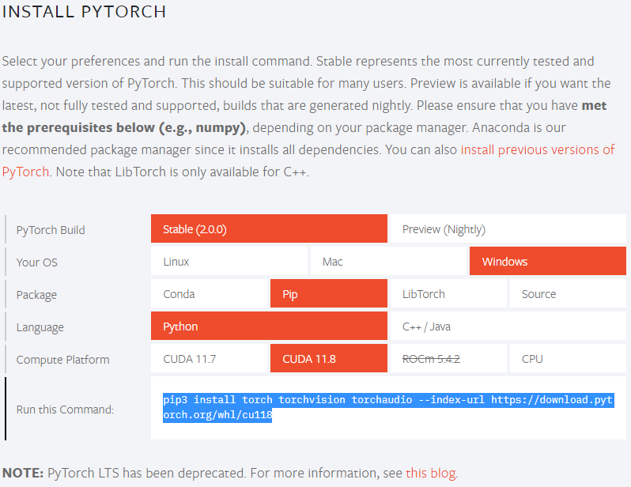
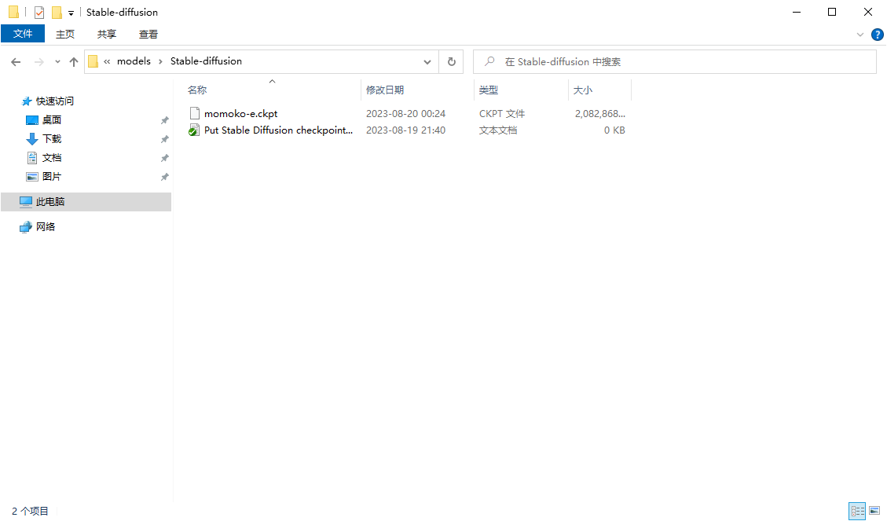
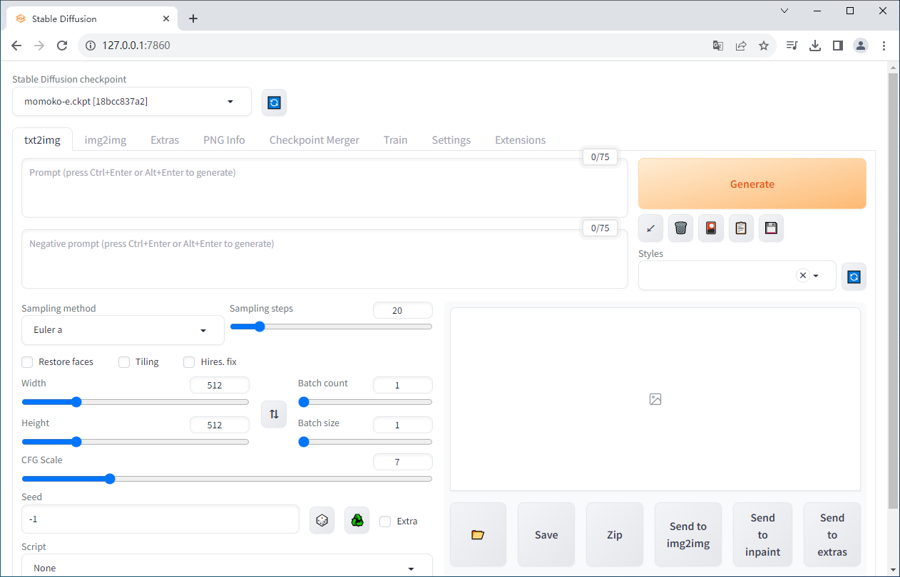
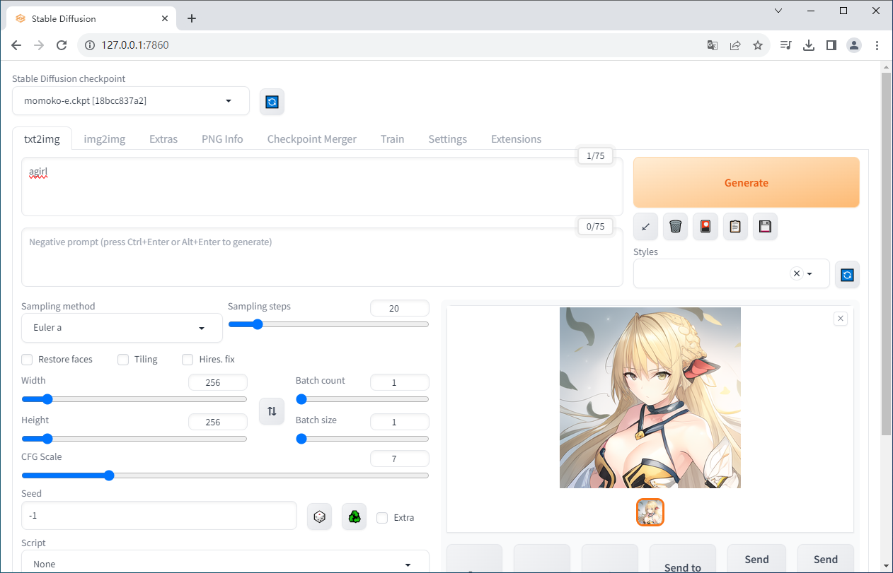
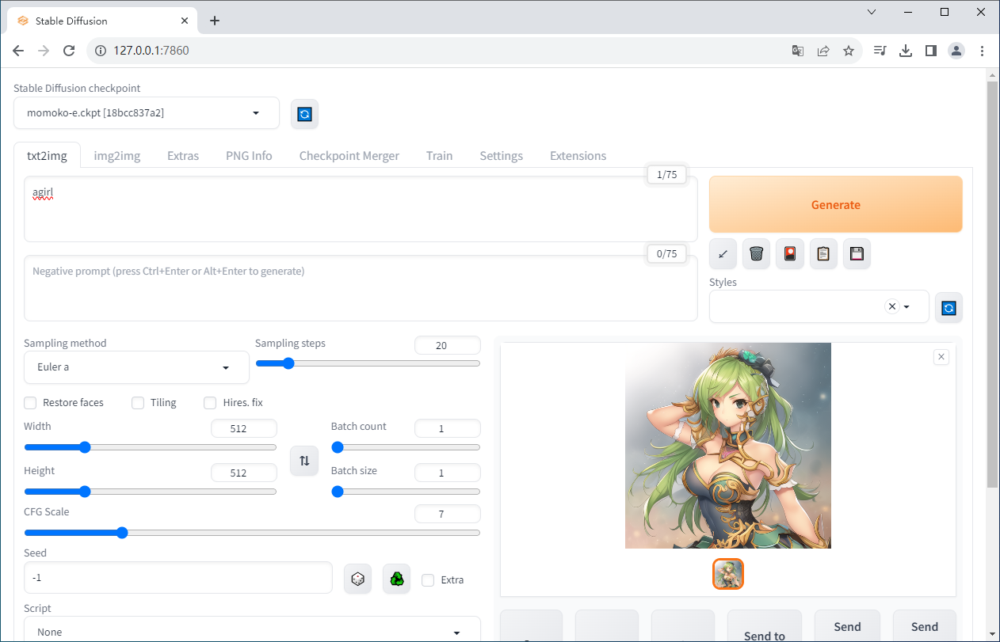

# 一、下载项目文件

## 1、项目下载命令

```
git clone git@github.com:freegithuber/stable-diffusion-webui.git H:\workspaces\stable-diffusion-webui
```

```
H:\workspaces>git clone git@github.com:freegithuber/stable-diffusion-webui.git H:\workspaces\stable-diffusion-webui
Cloning into 'H:\workspaces\stable-diffusion-webui'...
remote: Enumerating objects: 27899, done.
remote: Total 27899 (delta 0), reused 0 (delta 0), pack-reused 27899
Receiving objects: 100% (27899/27899), 32.53 MiB | 2.22 MiB/s, done.
Resolving deltas: 100% (19486/19486), done.

H:\workspaces>
```

## 2、切换版本命令

```
H:\workspaces>cd H:\workspaces\stable-diffusion-webui

H:\workspaces\stable-diffusion-webui>git checkout v1.5.2
Note: checking out 'v1.5.2'.

You are in 'detached HEAD' state. You can look around, make experimental
changes and commit them, and you can discard any commits you make in this
state without impacting any branches by performing another checkout.

If you want to create a new branch to retain commits you create, you may
do so (now or later) by using -b with the checkout command again. Example:

  git checkout -b <new-branch-name>

HEAD is now at c9c8485b Merge branch 'release_candidate'

H:\workspaces\stable-diffusion-webui>git checkout -b v1.5.2-doc
Switched to a new branch 'v1.5.2-doc'

H:\workspaces\stable-diffusion-webui>
```

# 二、创建项目环境

## 1、创建 conda 环境

```
conda create --prefix H:\workspaces\stable-diffusion-webui\.venv python=3.10.6
```

```
H:\workspaces>conda create --prefix H:\workspaces\stable-diffusion-webui\.venv python=3.10.6
Collecting package metadata (current_repodata.json): done
Solving environment: failed with repodata from current_repodata.json, will retry with next repodata source.
Collecting package metadata (repodata.json): done
Solving environment: done


==> WARNING: A newer version of conda exists. <==
  current version: 23.1.0
  latest version: 23.11.0

Please update conda by running

    $ conda update -n base -c defaults conda

Or to minimize the number of packages updated during conda update use

     conda install conda=23.11.0


## Package Plan ##

  environment location: H:\workspaces\stable-diffusion-webui\.venv

  added / updated specs:
    - python=3.10.6


The following NEW packages will be INSTALLED:

  bzip2              pkgs/main/win-64::bzip2-1.0.8-he774522_0
  ca-certificates    pkgs/main/win-64::ca-certificates-2023.08.22-haa95532_0
  libffi             pkgs/main/win-64::libffi-3.4.4-hd77b12b_0
  openssl            pkgs/main/win-64::openssl-1.1.1w-h2bbff1b_0
  pip                pkgs/main/win-64::pip-23.3.1-py310haa95532_0
  python             pkgs/main/win-64::python-3.10.6-hbb2ffb3_1
  setuptools         pkgs/main/win-64::setuptools-68.0.0-py310haa95532_0
  sqlite             pkgs/main/win-64::sqlite-3.41.2-h2bbff1b_0
  tk                 pkgs/main/win-64::tk-8.6.12-h2bbff1b_0
  tzdata             pkgs/main/noarch::tzdata-2023c-h04d1e81_0
  vc                 pkgs/main/win-64::vc-14.2-h21ff451_1
  vs2015_runtime     pkgs/main/win-64::vs2015_runtime-14.27.29016-h5e58377_2
  wheel              pkgs/main/win-64::wheel-0.41.2-py310haa95532_0
  xz                 pkgs/main/win-64::xz-5.4.5-h8cc25b3_0
  zlib               pkgs/main/win-64::zlib-1.2.13-h8cc25b3_0


Proceed ([y]/n)? y


Downloading and Extracting Packages

Preparing transaction: done
Verifying transaction: done
Executing transaction: done
#
# To activate this environment, use
#
#     $ conda activate H:\workspaces\stable-diffusion-webui\.venv
#
# To deactivate an active environment, use
#
#     $ conda deactivate


H:\workspaces>
H:\workspaces>
```

## 2、查看 conda 环境

```
conda env list
```

```
H:\workspaces>conda env list
# conda environments:
#
base                     D:\ProgramTools\miniconda3
                         H:\workspaces\stable-diffusion-webui\.venv


H:\workspaces>
```

## 3、激活 conda 环境

```
conda activate H:\workspaces\stable-diffusion-webui\.venv
```

```
H:\workspaces>conda activate H:\workspaces\stable-diffusion-webui\.venv

(H:\workspaces\stable-diffusion-webui\.venv) H:\workspaces>python -V
Python 3.10.6

(H:\workspaces\stable-diffusion-webui\.venv) H:\workspaces>
```

## 4、退出 conda 环境

```
conda deactivate
```

```
H:\workspaces>conda activate H:\workspaces\stable-diffusion-webui\.venv

(H:\workspaces\stable-diffusion-webui\.venv) H:\workspaces>python -V
Python 3.10.6

(H:\workspaces\stable-diffusion-webui\.venv) H:\workspaces>conda deactivate

H:\workspaces>
```

## 5、删除 conda 环境

```
conda remove -p H:\workspaces\stable-diffusion-webui\.venv --all
```

```
H:\workspaces>conda remove -p H:\workspaces\stable-diffusion-webui\.venv --all

Remove all packages in environment H:\workspaces\stable-diffusion-webui\.venv:


## Package Plan ##

  environment location: H:\workspaces\stable-diffusion-webui\.venv


The following packages will be REMOVED:

  bzip2-1.0.8-he774522_0
  ca-certificates-2023.08.22-haa95532_0
  libffi-3.4.4-hd77b12b_0
  openssl-1.1.1w-h2bbff1b_0
  pip-23.3.1-py310haa95532_0
  python-3.10.6-hbb2ffb3_1
  setuptools-68.0.0-py310haa95532_0
  sqlite-3.41.2-h2bbff1b_0
  tk-8.6.12-h2bbff1b_0
  tzdata-2023c-h04d1e81_0
  vc-14.2-h21ff451_1
  vs2015_runtime-14.27.29016-h5e58377_2
  wheel-0.41.2-py310haa95532_0
  xz-5.4.5-h8cc25b3_0
  zlib-1.2.13-h8cc25b3_0


Proceed ([y]/n)? y

Preparing transaction: done
Verifying transaction: done
Executing transaction: done

H:\workspaces>
```

# 三、安装前置软件

## 1、[CUDA Toolkit 11.8](https://developer.nvidia.com/cuda-11-8-0-download-archive?target_os=Windows&target_arch=x86_64&target_version=10&target_type=exe_local)

 

## 2、[PyTorch 2.0](https://pytorch.org/)

 

### 1. 安装命令

```
文件【H:\workspaces\stable-diffusion-webui\modules\launch_utils.py】的第 311 行有安装命令
```

```
python -m pip install torch==2.0.1 torchvision==0.15.2 --extra-index-url https://download.pytorch.org/whl/cu118
```

### 2. 安装日志

```
(H:\workspaces\stable-diffusion-webui\.venv) H:\workspaces>python -m pip install torch==2.0.1 torchvision==0.15.2 --extra-index-url https://download.pytorch.org/whl/cu118
Looking in indexes: https://mirrors.aliyun.com/pypi/simple/, https://download.pytorch.org/whl/cu118
Collecting torch==2.0.1
  Downloading https://download.pytorch.org/whl/cu118/torch-2.0.1%2Bcu118-cp310-cp310-win_amd64.whl (2619.1 MB)
     ---------------------------------------- 2.6/2.6 GB 375.5 kB/s eta 0:00:00
Collecting torchvision==0.15.2
  Downloading https://download.pytorch.org/whl/cu118/torchvision-0.15.2%2Bcu118-cp310-cp310-win_amd64.whl (4.9 MB)
     ---------------------------------------- 4.9/4.9 MB 15.1 MB/s eta 0:00:00
Collecting filelock (from torch==2.0.1)
  Downloading https://mirrors.aliyun.com/pypi/packages/00/45/ec3407adf6f6b5bf867a4462b2b0af27597a26bd3cd6e2534cb6ab029938/filelock-3.12.2-py3-none-any.whl (10 kB)
Collecting typing-extensions (from torch==2.0.1)
  Downloading https://mirrors.aliyun.com/pypi/packages/ec/6b/63cc3df74987c36fe26157ee12e09e8f9db4de771e0f3404263117e75b95/typing_extensions-4.7.1-py3-none-any.whl (33 kB)
Collecting sympy (from torch==2.0.1)
  Downloading https://mirrors.aliyun.com/pypi/packages/d2/05/e6600db80270777c4a64238a98d442f0fd07cc8915be2a1c16da7f2b9e74/sympy-1.12-py3-none-any.whl (5.7 MB)
     ---------------------------------------- 5.7/5.7 MB 777.2 kB/s eta 0:00:00
Collecting networkx (from torch==2.0.1)
  Downloading https://mirrors.aliyun.com/pypi/packages/a8/05/9d4f9b78ead6b2661d6e8ea772e111fc4a9fbd866ad0c81906c11206b55e/networkx-3.1-py3-none-any.whl (2.1 MB)
     ---------------------------------------- 2.1/2.1 MB 737.2 kB/s eta 0:00:00
Collecting jinja2 (from torch==2.0.1)
  Downloading https://download.pytorch.org/whl/Jinja2-3.1.2-py3-none-any.whl (133 kB)
     ---------------------------------------- 133.1/133.1 kB 3.8 MB/s eta 0:00:00
Collecting numpy (from torchvision==0.15.2)
  Downloading https://mirrors.aliyun.com/pypi/packages/b7/db/4d37359e2c9cf8bf071c08b8a6f7374648a5ab2e76e2e22e3b808f81d507/numpy-1.25.2-cp310-cp310-win_amd64.whl (15.6 MB)
     ---------------------------------------- 15.6/15.6 MB 795.7 kB/s eta 0:00:00
Collecting requests (from torchvision==0.15.2)
  Downloading https://mirrors.aliyun.com/pypi/packages/70/8e/0e2d847013cb52cd35b38c009bb167a1a26b2ce6cd6965bf26b47bc0bf44/requests-2.31.0-py3-none-any.whl (62 kB)
     ---------------------------------------- 62.6/62.6 kB 662.5 kB/s eta 0:00:00
Collecting pillow!=8.3.*,>=5.3.0 (from torchvision==0.15.2)
  Downloading https://mirrors.aliyun.com/pypi/packages/d0/4f/faebe1180e5e6ad6330c539dda7f6081182157393ba6816a438f759a0e59/Pillow-10.0.0-cp310-cp310-win_amd64.whl (2.5 MB)
     ---------------------------------------- 2.5/2.5 MB 817.4 kB/s eta 0:00:00
Collecting MarkupSafe>=2.0 (from jinja2->torch==2.0.1)
  Downloading https://mirrors.aliyun.com/pypi/packages/84/a8/c4aebb8a14a1d39d5135eb8233a0b95831cdc42c4088358449c3ed657044/MarkupSafe-2.1.3-cp310-cp310-win_amd64.whl (17 kB)
Collecting charset-normalizer<4,>=2 (from requests->torchvision==0.15.2)
  Downloading https://mirrors.aliyun.com/pypi/packages/5c/f2/f3faa20684729d3910af2ee142e30432c7a46a817eadeeab87366ed87bbb/charset_normalizer-3.2.0-cp310-cp310-win_amd64.whl (96 kB)
     ---------------------------------------- 96.9/96.9 kB 788.0 kB/s eta 0:00:00
Collecting idna<4,>=2.5 (from requests->torchvision==0.15.2)
  Downloading https://download.pytorch.org/whl/idna-3.4-py3-none-any.whl (61 kB)
     ---------------------------------------- 61.5/61.5 kB 1.6 MB/s eta 0:00:00
Collecting urllib3<3,>=1.21.1 (from requests->torchvision==0.15.2)
  Downloading https://mirrors.aliyun.com/pypi/packages/9b/81/62fd61001fa4b9d0df6e31d47ff49cfa9de4af03adecf339c7bc30656b37/urllib3-2.0.4-py3-none-any.whl (123 kB)
     ---------------------------------------- 123.9/123.9 kB 806.2 kB/s eta 0:00:00
Collecting certifi>=2017.4.17 (from requests->torchvision==0.15.2)
  Downloading https://mirrors.aliyun.com/pypi/packages/4c/dd/2234eab22353ffc7d94e8d13177aaa050113286e93e7b40eae01fbf7c3d9/certifi-2023.7.22-py3-none-any.whl (158 kB)
     ---------------------------------------- 158.3/158.3 kB 1.2 MB/s eta 0:00:00
Collecting mpmath>=0.19 (from sympy->torch==2.0.1)
  Downloading https://mirrors.aliyun.com/pypi/packages/43/e3/7d92a15f894aa0c9c4b49b8ee9ac9850d6e63b03c9c32c0367a13ae62209/mpmath-1.3.0-py3-none-any.whl (536 kB)
     ---------------------------------------- 536.2/536.2 kB 1.3 MB/s eta 0:00:00
Installing collected packages: mpmath, urllib3, typing-extensions, sympy, pillow, numpy, networkx, MarkupSafe, idna, filelock, charset-normalizer, certifi, requests, jinja2, torch, torchvision
Successfully installed MarkupSafe-2.1.3 certifi-2023.7.22 charset-normalizer-3.2.0 filelock-3.12.2 idna-3.4 jinja2-3.1.2 mpmath-1.3.0 networkx-3.1 numpy-1.25.2 pillow-10.0.0 requests-2.31.0 sympy-1.12 torch-2.0.1+cu118 torchvision-0.15.2+cu118 typing-extensions-4.7.1 urllib3-2.0.4

(H:\workspaces\stable-diffusion-webui\.venv) H:\workspaces>
```

### 3. 测试命令

```
python -c "import torch; print(torch.cuda.is_available())"
```

### 4. 测试日志

```
(H:\workspaces\stable-diffusion-webui\.venv) H:\workspaces>python -c "import torch; print(torch.cuda.is_available())"
True

(H:\workspaces\stable-diffusion-webui\.venv) H:\workspaces>
```

# 四、安装前置依赖

## 1、安装 gfpgan

```
文件【H:\workspaces\stable-diffusion-webui\modules\launch_utils.py】的第 320 行有安装命令
```

```
python -m pip install https://github.com/TencentARC/GFPGAN/archive/8d2447a2d918f8eba5a4a01463fd48e45126a379.zip --prefer-binary
```

安装日志：

```
(H:\workspaces\stable-diffusion-webui\.venv) H:\workspaces>python -m pip install https://github.com/TencentARC/GFPGAN/archive/8d2447a2d918f8eba5a4a01463fd48e45126a379.zip --prefer-binary
Looking in indexes: https://mirrors.aliyun.com/pypi/simple/
Collecting https://github.com/TencentARC/GFPGAN/archive/8d2447a2d918f8eba5a4a01463fd48e45126a379.zip
  Downloading https://github.com/TencentARC/GFPGAN/archive/8d2447a2d918f8eba5a4a01463fd48e45126a379.zip (6.0 MB)
     ---------------------------------------- 6.0/6.0 MB 116.5 kB/s eta 0:00:00
  Preparing metadata (setup.py) ... done
Collecting basicsr>=1.4.2 (from gfpgan==1.3.5)
  Downloading https://mirrors.aliyun.com/pypi/packages/86/41/00a6b000f222f0fa4c6d9e1d6dcc9811a374cabb8abb9d408b77de39648c/basicsr-1.4.2.tar.gz (172 kB)
     ---------------------------------------- 172.5/172.5 kB 1.5 MB/s eta 0:00:00
  Preparing metadata (setup.py) ... done
Collecting facexlib>=0.2.5 (from gfpgan==1.3.5)
  Downloading https://mirrors.aliyun.com/pypi/packages/36/7b/2147339dafe1c4800514c9c21ee4444f8b419ce51dfc7695220a8e0069a6/facexlib-0.3.0-py3-none-any.whl (59 kB)
     ---------------------------------------- 59.6/59.6 kB 1.6 MB/s eta 0:00:00
Collecting lmdb (from gfpgan==1.3.5)
  Downloading https://mirrors.aliyun.com/pypi/packages/66/05/21a93eed7ff800f7c3b0538eb12bde89660a44693624cd0e49141beccb8b/lmdb-1.4.1-cp310-cp310-win_amd64.whl (100 kB)
     ---------------------------------------- 100.1/100.1 kB 2.9 MB/s eta 0:00:00
Requirement already satisfied: numpy in h:\workspaces\stable-diffusion-webui\.venv\lib\site-packages (from gfpgan==1.3.5) (1.25.2)
Collecting opencv-python (from gfpgan==1.3.5)
  Downloading https://mirrors.aliyun.com/pypi/packages/fb/c4/f574ba6f04e6d7bf8c38d23e7a52389566dd7631fee0bcdd79ea07ef2dbf/opencv_python-4.8.0.76-cp37-abi3-win_amd64.whl (38.1 MB)
     ---------------------------------------- 38.1/38.1 MB 7.4 MB/s eta 0:00:00
Collecting pyyaml (from gfpgan==1.3.5)
  Downloading https://mirrors.aliyun.com/pypi/packages/24/97/9b59b43431f98d01806b288532da38099cc6f2fea0f3d712e21e269c0279/PyYAML-6.0.1-cp310-cp310-win_amd64.whl (145 kB)
     ---------------------------------------- 145.3/145.3 kB 4.4 MB/s eta 0:00:00
Collecting scipy (from gfpgan==1.3.5)
  Downloading https://mirrors.aliyun.com/pypi/packages/70/03/485f73046134400ea25d3cb178c5e6728f9b165f79d09638ecb44ee0e9b1/scipy-1.11.2-cp310-cp310-win_amd64.whl (44.0 MB)
     ---------------------------------------- 44.0/44.0 MB 6.4 MB/s eta 0:00:00
Collecting tb-nightly (from gfpgan==1.3.5)
  Downloading https://mirrors.aliyun.com/pypi/packages/42/df/63ddd1e7d33f2ba4279d0aaaccb5e8e04e136f0367ecfe5e23715ab7eb36/tb_nightly-2.15.0a20230819-py3-none-any.whl (5.5 MB)
     ---------------------------------------- 5.5/5.5 MB 9.8 MB/s eta 0:00:00
Requirement already satisfied: torch>=1.7 in h:\workspaces\stable-diffusion-webui\.venv\lib\site-packages (from gfpgan==1.3.5) (2.0.1+cu118)
Requirement already satisfied: torchvision in h:\workspaces\stable-diffusion-webui\.venv\lib\site-packages (from gfpgan==1.3.5) (0.15.2+cu118)
Collecting tqdm (from gfpgan==1.3.5)
  Downloading https://mirrors.aliyun.com/pypi/packages/00/e5/f12a80907d0884e6dff9c16d0c0114d81b8cd07dc3ae54c5e962cc83037e/tqdm-4.66.1-py3-none-any.whl (78 kB)
     ---------------------------------------- 78.3/78.3 kB 1.4 MB/s eta 0:00:00
Collecting yapf (from gfpgan==1.3.5)
  Downloading https://mirrors.aliyun.com/pypi/packages/23/75/c374517c09e31bf22d3b3f156d73e0f38d08e29b2afdd607cef5f1e10aa9/yapf-0.40.1-py3-none-any.whl (250 kB)
     ---------------------------------------- 250.3/250.3 kB 3.9 MB/s eta 0:00:00
Collecting addict (from basicsr>=1.4.2->gfpgan==1.3.5)
  Downloading https://mirrors.aliyun.com/pypi/packages/6a/00/b08f23b7d7e1e14ce01419a467b583edbb93c6cdb8654e54a9cc579cd61f/addict-2.4.0-py3-none-any.whl (3.8 kB)
Collecting future (from basicsr>=1.4.2->gfpgan==1.3.5)
  Downloading https://mirrors.aliyun.com/pypi/packages/8f/2e/cf6accf7415237d6faeeebdc7832023c90e0282aa16fd3263db0eb4715ec/future-0.18.3.tar.gz (840 kB)
     ---------------------------------------- 840.9/840.9 kB 8.8 MB/s eta 0:00:00
  Preparing metadata (setup.py) ... done
Requirement already satisfied: Pillow in h:\workspaces\stable-diffusion-webui\.venv\lib\site-packages (from basicsr>=1.4.2->gfpgan==1.3.5) (10.0.0)
Requirement already satisfied: requests in h:\workspaces\stable-diffusion-webui\.venv\lib\site-packages (from basicsr>=1.4.2->gfpgan==1.3.5) (2.31.0)
Collecting scikit-image (from basicsr>=1.4.2->gfpgan==1.3.5)
  Downloading https://mirrors.aliyun.com/pypi/packages/f3/93/65601f7577d6fd49ec23bf8fb58c04d8170b06a1544452ae2ea9f59bf11f/scikit_image-0.21.0-cp310-cp310-win_amd64.whl (22.8 MB)
     ---------------------------------------- 22.8/22.8 MB 8.4 MB/s eta 0:00:00
Collecting filterpy (from facexlib>=0.2.5->gfpgan==1.3.5)
  Downloading https://mirrors.aliyun.com/pypi/packages/f6/1d/ac8914360460fafa1990890259b7fa5ef7ba4cd59014e782e4ab3ab144d8/filterpy-1.4.5.zip (177 kB)
     ---------------------------------------- 178.0/178.0 kB 3.6 MB/s eta 0:00:00
  Preparing metadata (setup.py) ... done
Collecting numba (from facexlib>=0.2.5->gfpgan==1.3.5)
  Downloading https://mirrors.aliyun.com/pypi/packages/f3/3e/6349c624303b78b6bbb97168c7fb38a1a0cb1605ae4c5d45af3b829f067a/numba-0.57.1-cp310-cp310-win_amd64.whl (2.5 MB)
     ---------------------------------------- 2.5/2.5 MB 9.5 MB/s eta 0:00:00
Requirement already satisfied: filelock in h:\workspaces\stable-diffusion-webui\.venv\lib\site-packages (from torch>=1.7->gfpgan==1.3.5) (3.12.2)
Requirement already satisfied: typing-extensions in h:\workspaces\stable-diffusion-webui\.venv\lib\site-packages (from torch>=1.7->gfpgan==1.3.5) (4.7.1)
Requirement already satisfied: sympy in h:\workspaces\stable-diffusion-webui\.venv\lib\site-packages (from torch>=1.7->gfpgan==1.3.5) (1.12)
Requirement already satisfied: networkx in h:\workspaces\stable-diffusion-webui\.venv\lib\site-packages (from torch>=1.7->gfpgan==1.3.5) (3.1)
Requirement already satisfied: jinja2 in h:\workspaces\stable-diffusion-webui\.venv\lib\site-packages (from torch>=1.7->gfpgan==1.3.5) (3.1.2)
Collecting absl-py>=0.4 (from tb-nightly->gfpgan==1.3.5)
  Downloading https://mirrors.aliyun.com/pypi/packages/dd/87/de5c32fa1b1c6c3305d576e299801d8655c175ca9557019906247b994331/absl_py-1.4.0-py3-none-any.whl (126 kB)
     ---------------------------------------- 126.5/126.5 kB 2.5 MB/s eta 0:00:00
Collecting grpcio>=1.48.2 (from tb-nightly->gfpgan==1.3.5)
  Downloading https://mirrors.aliyun.com/pypi/packages/b7/80/56048dd2223a075f421dba172074c93d5545a4348e0699eee15120b4f41d/grpcio-1.57.0-cp310-cp310-win_amd64.whl (4.3 MB)
     ---------------------------------------- 4.3/4.3 MB 9.1 MB/s eta 0:00:00
Collecting google-auth<3,>=1.6.3 (from tb-nightly->gfpgan==1.3.5)
  Downloading https://mirrors.aliyun.com/pypi/packages/9c/8d/bff87fc722553a5691d8514da5523c23547f3894189ba03b57592e37bdc2/google_auth-2.22.0-py2.py3-none-any.whl (181 kB)
     ---------------------------------------- 181.8/181.8 kB 3.6 MB/s eta 0:00:00
Collecting google-auth-oauthlib<1.1,>=0.5 (from tb-nightly->gfpgan==1.3.5)
  Downloading https://mirrors.aliyun.com/pypi/packages/4a/07/8d9a8186e6768b55dfffeb57c719bc03770cf8a970a074616ae6f9e26a57/google_auth_oauthlib-1.0.0-py2.py3-none-any.whl (18 kB)
Collecting markdown>=2.6.8 (from tb-nightly->gfpgan==1.3.5)
  Downloading https://mirrors.aliyun.com/pypi/packages/1a/b5/228c1cdcfe138f1a8e01ab1b54284c8b83735476cb22b6ba251656ed13ad/Markdown-3.4.4-py3-none-any.whl (94 kB)
     ---------------------------------------- 94.2/94.2 kB 1.1 MB/s eta 0:00:00
Collecting protobuf<4.24,>=3.19.6 (from tb-nightly->gfpgan==1.3.5)
  Downloading https://mirrors.aliyun.com/pypi/packages/80/70/dc63d340d27b8ff22022d7dd14b8d6d68b479a003eacdc4507150a286d9a/protobuf-4.23.4-cp310-abi3-win_amd64.whl (422 kB)
     ---------------------------------------- 422.5/422.5 kB 6.6 MB/s eta 0:00:00
Requirement already satisfied: setuptools>=41.0.0 in h:\workspaces\stable-diffusion-webui\.venv\lib\site-packages (from tb-nightly->gfpgan==1.3.5) (68.0.0)
Collecting tensorboard-data-server<0.8.0,>=0.7.0 (from tb-nightly->gfpgan==1.3.5)
  Downloading https://mirrors.aliyun.com/pypi/packages/da/61/6e9ff8258422d287eec718872fb71e05324356722ab658c8afda25f51539/tensorboard_data_server-0.7.1-py3-none-any.whl (2.4 kB)
Collecting werkzeug>=1.0.1 (from tb-nightly->gfpgan==1.3.5)
  Downloading https://mirrors.aliyun.com/pypi/packages/9b/59/a7c32e3d8d0e546a206e0552a2c04444544f15c1da4a01df8938d20c6ffc/werkzeug-2.3.7-py3-none-any.whl (242 kB)
     ---------------------------------------- 242.2/242.2 kB 1.9 MB/s eta 0:00:00
Requirement already satisfied: wheel>=0.26 in h:\workspaces\stable-diffusion-webui\.venv\lib\site-packages (from tb-nightly->gfpgan==1.3.5) (0.38.4)
Collecting colorama (from tqdm->gfpgan==1.3.5)
  Downloading https://mirrors.aliyun.com/pypi/packages/d1/d6/3965ed04c63042e047cb6a3e6ed1a63a35087b6a609aa3a15ed8ac56c221/colorama-0.4.6-py2.py3-none-any.whl (25 kB)
Collecting importlib-metadata>=6.6.0 (from yapf->gfpgan==1.3.5)
  Downloading https://mirrors.aliyun.com/pypi/packages/cc/37/db7ba97e676af155f5fcb1a35466f446eadc9104e25b83366e8088c9c926/importlib_metadata-6.8.0-py3-none-any.whl (22 kB)
Collecting platformdirs>=3.5.1 (from yapf->gfpgan==1.3.5)
  Downloading https://mirrors.aliyun.com/pypi/packages/14/51/fe5a0d6ea589f0d4a1b97824fb518962ad48b27cd346dcdfa2405187997a/platformdirs-3.10.0-py3-none-any.whl (17 kB)
Collecting tomli>=2.0.1 (from yapf->gfpgan==1.3.5)
  Downloading https://mirrors.aliyun.com/pypi/packages/97/75/10a9ebee3fd790d20926a90a2547f0bf78f371b2f13aa822c759680ca7b9/tomli-2.0.1-py3-none-any.whl (12 kB)
Collecting cachetools<6.0,>=2.0.0 (from google-auth<3,>=1.6.3->tb-nightly->gfpgan==1.3.5)
  Downloading https://mirrors.aliyun.com/pypi/packages/a9/c9/c8a7710f2cedcb1db9224fdd4d8307c9e48cbddc46c18b515fefc0f1abbe/cachetools-5.3.1-py3-none-any.whl (9.3 kB)
Collecting pyasn1-modules>=0.2.1 (from google-auth<3,>=1.6.3->tb-nightly->gfpgan==1.3.5)
  Downloading https://mirrors.aliyun.com/pypi/packages/cd/8e/bea464350e1b8c6ed0da3a312659cb648804a08af6cacc6435867f74f8bd/pyasn1_modules-0.3.0-py2.py3-none-any.whl (181 kB)
     ---------------------------------------- 181.3/181.3 kB 5.5 MB/s eta 0:00:00
Collecting rsa<5,>=3.1.4 (from google-auth<3,>=1.6.3->tb-nightly->gfpgan==1.3.5)
  Downloading https://mirrors.aliyun.com/pypi/packages/49/97/fa78e3d2f65c02c8e1268b9aba606569fe97f6c8f7c2d74394553347c145/rsa-4.9-py3-none-any.whl (34 kB)
Collecting six>=1.9.0 (from google-auth<3,>=1.6.3->tb-nightly->gfpgan==1.3.5)
  Downloading https://mirrors.aliyun.com/pypi/packages/d9/5a/e7c31adbe875f2abbb91bd84cf2dc52d792b5a01506781dbcf25c91daf11/six-1.16.0-py2.py3-none-any.whl (11 kB)
Collecting urllib3<2.0 (from google-auth<3,>=1.6.3->tb-nightly->gfpgan==1.3.5)
  Downloading https://mirrors.aliyun.com/pypi/packages/c5/05/c214b32d21c0b465506f95c4f28ccbcba15022e000b043b72b3df7728471/urllib3-1.26.16-py2.py3-none-any.whl (143 kB)
     ---------------------------------------- 143.1/143.1 kB 2.1 MB/s eta 0:00:00
Collecting requests-oauthlib>=0.7.0 (from google-auth-oauthlib<1.1,>=0.5->tb-nightly->gfpgan==1.3.5)
  Downloading https://mirrors.aliyun.com/pypi/packages/6f/bb/5deac77a9af870143c684ab46a7934038a53eb4aa975bc0687ed6ca2c610/requests_oauthlib-1.3.1-py2.py3-none-any.whl (23 kB)
Collecting zipp>=0.5 (from importlib-metadata>=6.6.0->yapf->gfpgan==1.3.5)
  Downloading https://mirrors.aliyun.com/pypi/packages/8c/08/d3006317aefe25ea79d3b76c9650afabaf6d63d1c8443b236e7405447503/zipp-3.16.2-py3-none-any.whl (7.2 kB)
Requirement already satisfied: charset-normalizer<4,>=2 in h:\workspaces\stable-diffusion-webui\.venv\lib\site-packages (from requests->basicsr>=1.4.2->gfpgan==1.3.5) (3.2.0)
Requirement already satisfied: idna<4,>=2.5 in h:\workspaces\stable-diffusion-webui\.venv\lib\site-packages (from requests->basicsr>=1.4.2->gfpgan==1.3.5) (3.4)
Requirement already satisfied: certifi>=2017.4.17 in h:\workspaces\stable-diffusion-webui\.venv\lib\site-packages (from requests->basicsr>=1.4.2->gfpgan==1.3.5) (2023.7.22)
Requirement already satisfied: MarkupSafe>=2.1.1 in h:\workspaces\stable-diffusion-webui\.venv\lib\site-packages (from werkzeug>=1.0.1->tb-nightly->gfpgan==1.3.5) (2.1.3)
Collecting matplotlib (from filterpy->facexlib>=0.2.5->gfpgan==1.3.5)
  Downloading https://mirrors.aliyun.com/pypi/packages/ff/1f/2b83c7acf453318a80dc619e99fc30a663b2c1fb18be3d358a96addfecd9/matplotlib-3.7.2-cp310-cp310-win_amd64.whl (7.5 MB)
     ---------------------------------------- 7.5/7.5 MB 9.1 MB/s eta 0:00:00
Collecting llvmlite<0.41,>=0.40.0dev0 (from numba->facexlib>=0.2.5->gfpgan==1.3.5)
  Downloading https://mirrors.aliyun.com/pypi/packages/6c/4f/e6f9dc0b34e5b8450ef757cd35afda999c8cc5098907a512cf0ecae840b5/llvmlite-0.40.1-cp310-cp310-win_amd64.whl (27.7 MB)
     ---------------------------------------- 27.7/27.7 MB 8.0 MB/s eta 0:00:00
Collecting numpy (from gfpgan==1.3.5)
  Downloading https://mirrors.aliyun.com/pypi/packages/22/55/3d5a7c1142e0d9329ad27cece17933b0e2ab4e54ddc5c1861fbfeb3f7693/numpy-1.24.4-cp310-cp310-win_amd64.whl (14.8 MB)
     ---------------------------------------- 14.8/14.8 MB 9.1 MB/s eta 0:00:00
Collecting imageio>=2.27 (from scikit-image->basicsr>=1.4.2->gfpgan==1.3.5)
  Downloading https://mirrors.aliyun.com/pypi/packages/c7/b0/7b6c35b8636ed773325cdb6f5ac3cd36afba63d99e20ed59c521cf5018b4/imageio-2.31.1-py3-none-any.whl (313 kB)
     ---------------------------------------- 313.2/313.2 kB 2.2 MB/s eta 0:00:00
Collecting tifffile>=2022.8.12 (from scikit-image->basicsr>=1.4.2->gfpgan==1.3.5)
  Downloading https://mirrors.aliyun.com/pypi/packages/74/68/19989a1009f68ed777ea5d2624c2996bab0890a31ce7d4b2a7ae4e1c0cfe/tifffile-2023.8.12-py3-none-any.whl (220 kB)
     ---------------------------------------- 221.0/221.0 kB 6.8 MB/s eta 0:00:00
Collecting PyWavelets>=1.1.1 (from scikit-image->basicsr>=1.4.2->gfpgan==1.3.5)
  Downloading https://mirrors.aliyun.com/pypi/packages/35/12/f1a4f72b5d71497e4200e71e253cc747077d8570b55693faaa7b81fb6dff/PyWavelets-1.4.1-cp310-cp310-win_amd64.whl (4.2 MB)
     ---------------------------------------- 4.2/4.2 MB 10.2 MB/s eta 0:00:00
Collecting packaging>=21 (from scikit-image->basicsr>=1.4.2->gfpgan==1.3.5)
  Downloading https://mirrors.aliyun.com/pypi/packages/ab/c3/57f0601a2d4fe15de7a553c00adbc901425661bf048f2a22dfc500caf121/packaging-23.1-py3-none-any.whl (48 kB)
     ---------------------------------------- 48.9/48.9 kB 822.7 kB/s eta 0:00:00
Collecting lazy_loader>=0.2 (from scikit-image->basicsr>=1.4.2->gfpgan==1.3.5)
  Downloading https://mirrors.aliyun.com/pypi/packages/a1/c3/65b3814e155836acacf720e5be3b5757130346670ac454fee29d3eda1381/lazy_loader-0.3-py3-none-any.whl (9.1 kB)
Requirement already satisfied: mpmath>=0.19 in h:\workspaces\stable-diffusion-webui\.venv\lib\site-packages (from sympy->torch>=1.7->gfpgan==1.3.5) (1.3.0)
Collecting pyasn1<0.6.0,>=0.4.6 (from pyasn1-modules>=0.2.1->google-auth<3,>=1.6.3->tb-nightly->gfpgan==1.3.5)
  Downloading https://mirrors.aliyun.com/pypi/packages/14/e5/b56a725cbde139aa960c26a1a3ca4d4af437282e20b5314ee6a3501e7dfc/pyasn1-0.5.0-py2.py3-none-any.whl (83 kB)
     ---------------------------------------- 83.9/83.9 kB 2.3 MB/s eta 0:00:00
Collecting oauthlib>=3.0.0 (from requests-oauthlib>=0.7.0->google-auth-oauthlib<1.1,>=0.5->tb-nightly->gfpgan==1.3.5)
  Downloading https://mirrors.aliyun.com/pypi/packages/7e/80/cab10959dc1faead58dc8384a781dfbf93cb4d33d50988f7a69f1b7c9bbe/oauthlib-3.2.2-py3-none-any.whl (151 kB)
     ---------------------------------------- 151.7/151.7 kB 392.9 kB/s eta 0:00:00
Collecting contourpy>=1.0.1 (from matplotlib->filterpy->facexlib>=0.2.5->gfpgan==1.3.5)
  Downloading https://mirrors.aliyun.com/pypi/packages/94/0a/5eb57dd395fade977786b2d2c98c2bee8234358794be44422fe58a719d42/contourpy-1.1.0-cp310-cp310-win_amd64.whl (470 kB)
     ---------------------------------------- 470.4/470.4 kB 9.8 MB/s eta 0:00:00
Collecting cycler>=0.10 (from matplotlib->filterpy->facexlib>=0.2.5->gfpgan==1.3.5)
  Downloading https://mirrors.aliyun.com/pypi/packages/5c/f9/695d6bedebd747e5eb0fe8fad57b72fdf25411273a39791cde838d5a8f51/cycler-0.11.0-py3-none-any.whl (6.4 kB)
Collecting fonttools>=4.22.0 (from matplotlib->filterpy->facexlib>=0.2.5->gfpgan==1.3.5)
  Downloading https://mirrors.aliyun.com/pypi/packages/8e/8a/2780329735ae21d7624f174616407aea106e19b149c46e7efbf2073d62f9/fonttools-4.42.0-cp310-cp310-win_amd64.whl (2.1 MB)
     ---------------------------------------- 2.1/2.1 MB 9.0 MB/s eta 0:00:00
Collecting kiwisolver>=1.0.1 (from matplotlib->filterpy->facexlib>=0.2.5->gfpgan==1.3.5)
  Downloading https://mirrors.aliyun.com/pypi/packages/68/20/2ce1186ef4edf47281faf58f6dd72a1fcd2be1fc66514bd2d220097bdcd1/kiwisolver-1.4.4-cp310-cp310-win_amd64.whl (55 kB)
     ---------------------------------------- 55.3/55.3 kB 1.5 MB/s eta 0:00:00
Collecting pyparsing<3.1,>=2.3.1 (from matplotlib->filterpy->facexlib>=0.2.5->gfpgan==1.3.5)
  Downloading https://mirrors.aliyun.com/pypi/packages/6c/10/a7d0fa5baea8fe7b50f448ab742f26f52b80bfca85ac2be9d35cdd9a3246/pyparsing-3.0.9-py3-none-any.whl (98 kB)
     ---------------------------------------- 98.3/98.3 kB 1.9 MB/s eta 0:00:00
Collecting python-dateutil>=2.7 (from matplotlib->filterpy->facexlib>=0.2.5->gfpgan==1.3.5)
  Downloading https://mirrors.aliyun.com/pypi/packages/36/7a/87837f39d0296e723bb9b62bbb257d0355c7f6128853c78955f57342a56d/python_dateutil-2.8.2-py2.py3-none-any.whl (247 kB)
     ---------------------------------------- 247.7/247.7 kB 7.4 MB/s eta 0:00:00
Building wheels for collected packages: gfpgan, basicsr, filterpy, future
  Building wheel for gfpgan (setup.py) ... done
  Created wheel for gfpgan: filename=gfpgan-1.3.5-py3-none-any.whl size=47795 sha256=ae590bee0335b5308a563c7bfe41ee19d1936d3d5da0353218399e2b77ef18dd
  Stored in directory: E:\usrtempsdir\pip-ephem-wheel-cache-8eblgwpt\wheels\6c\2e\05\61770553fc4fbd483546a20dc4a89b2819f77a89733157f154
  Building wheel for basicsr (setup.py) ... done
  Created wheel for basicsr: filename=basicsr-1.4.2-py3-none-any.whl size=214848 sha256=b844f22fc0e0d2ead7672c3b60978152657cfdb484dd8d8dd6270714256323ba
  Stored in directory: e:\repositories\pipche\wheels\db\02\67\4f5ec6101fe786da1c04630e2f4d14956c88fa940950319c04
  Building wheel for filterpy (setup.py) ... done
  Created wheel for filterpy: filename=filterpy-1.4.5-py3-none-any.whl size=110542 sha256=8fa08c77c46a561a03661df438f1b7fbcbd08f37721c0496a86240a2080e9970
  Stored in directory: e:\repositories\pipche\wheels\87\46\23\619a968242d88348ef872b17aa0e2038dfe1d5a0646b4d2f82
  Building wheel for future (setup.py) ... done
  Created wheel for future: filename=future-0.18.3-py3-none-any.whl size=492055 sha256=a4670c30a4a8de95eabe77b915f533c7538baa302be9bdfd00ebfc9fb78a0dc0
  Stored in directory: e:\repositories\pipche\wheels\be\18\47\d5969626128ced9332ea41d49f7a4586e29d4f738cf2c6f286
Successfully built gfpgan basicsr filterpy future
Installing collected packages: lmdb, addict, zipp, werkzeug, urllib3, tomli, tensorboard-data-server, six, pyyaml, pyparsing, pyasn1, protobuf, platformdirs, packaging, oauthlib, numpy, markdown, llvmlite, lazy_loader, kiwisolver, grpcio, future, fonttools, cycler, colorama, cachetools, absl-py, tqdm, tifffile, scipy, rsa, PyWavelets, python-dateutil, pyasn1-modules, opencv-python, numba, importlib-metadata, imageio, contourpy, yapf, scikit-image, requests-oauthlib, matplotlib, google-auth, google-auth-oauthlib, filterpy, tb-nightly, facexlib, basicsr, gfpgan
  Attempting uninstall: urllib3
    Found existing installation: urllib3 2.0.4
    Uninstalling urllib3-2.0.4:
      Successfully uninstalled urllib3-2.0.4
  Attempting uninstall: numpy
    Found existing installation: numpy 1.25.2
    Uninstalling numpy-1.25.2:
      Successfully uninstalled numpy-1.25.2
Successfully installed PyWavelets-1.4.1 absl-py-1.4.0 addict-2.4.0 basicsr-1.4.2 cachetools-5.3.1 colorama-0.4.6 contourpy-1.1.0 cycler-0.11.0 facexlib-0.3.0 filterpy-1.4.5 fonttools-4.42.0 future-0.18.3 gfpgan-1.3.5 google-auth-2.22.0 google-auth-oauthlib-1.0.0 grpcio-1.57.0 imageio-2.31.1 importlib-metadata-6.8.0 kiwisolver-1.4.4 lazy_loader-0.3 llvmlite-0.40.1 lmdb-1.4.1 markdown-3.4.4 matplotlib-3.7.2 numba-0.57.1 numpy-1.24.4 oauthlib-3.2.2 opencv-python-4.8.0.76 packaging-23.1 platformdirs-3.10.0 protobuf-4.23.4 pyasn1-0.5.0 pyasn1-modules-0.3.0 pyparsing-3.0.9 python-dateutil-2.8.2 pyyaml-6.0.1 requests-oauthlib-1.3.1 rsa-4.9 scikit-image-0.21.0 scipy-1.11.2 six-1.16.0 tb-nightly-2.15.0a20230819 tensorboard-data-server-0.7.1 tifffile-2023.8.12 tomli-2.0.1 tqdm-4.66.1 urllib3-1.26.16 werkzeug-2.3.7 yapf-0.40.1 zipp-3.16.2

(H:\workspaces\stable-diffusion-webui\.venv) H:\workspaces>
```

## 2、安装 clip

```
文件【H:\workspaces\stable-diffusion-webui\modules\launch_utils.py】的第 323 行有安装命令
```

```
python -m pip install https://github.com/openai/CLIP/archive/d50d76daa670286dd6cacf3bcd80b5e4823fc8e1.zip --prefer-binary
```

安装日志：

```
(H:\workspaces\stable-diffusion-webui\.venv) H:\workspaces>python -m pip install https://github.com/openai/CLIP/archive/d50d76daa670286dd6cacf3bcd80b5e4823fc8e1.zip --prefer-binary
Looking in indexes: https://mirrors.aliyun.com/pypi/simple/
Collecting https://github.com/openai/CLIP/archive/d50d76daa670286dd6cacf3bcd80b5e4823fc8e1.zip
  Downloading https://github.com/openai/CLIP/archive/d50d76daa670286dd6cacf3bcd80b5e4823fc8e1.zip (4.3 MB)
     ---------------------------------------- 4.3/4.3 MB 120.9 kB/s eta 0:00:00
  Preparing metadata (setup.py) ... done
Collecting ftfy (from clip==1.0)
  Downloading https://mirrors.aliyun.com/pypi/packages/e1/1e/bf736f9576a8979752b826b75cbd83663ff86634ea3055a766e2d8ad3ee5/ftfy-6.1.1-py3-none-any.whl (53 kB)
     ---------------------------------------- 53.1/53.1 kB 342.9 kB/s eta 0:00:00
Collecting regex (from clip==1.0)
  Downloading https://mirrors.aliyun.com/pypi/packages/e6/7c/96a44dabe8577f43ac34e34d0ac098ee42390a06fee4cbe8b5317ecf2520/regex-2023.8.8-cp310-cp310-win_amd64.whl (268 kB)
     ---------------------------------------- 268.3/268.3 kB 8.3 MB/s eta 0:00:00
Requirement already satisfied: tqdm in h:\workspaces\stable-diffusion-webui\.venv\lib\site-packages (from clip==1.0) (4.66.1)
Requirement already satisfied: torch in h:\workspaces\stable-diffusion-webui\.venv\lib\site-packages (from clip==1.0) (2.0.1+cu118)
Requirement already satisfied: torchvision in h:\workspaces\stable-diffusion-webui\.venv\lib\site-packages (from clip==1.0) (0.15.2+cu118)
Collecting wcwidth>=0.2.5 (from ftfy->clip==1.0)
  Downloading https://mirrors.aliyun.com/pypi/packages/20/f4/c0584a25144ce20bfcf1aecd041768b8c762c1eb0aa77502a3f0baa83f11/wcwidth-0.2.6-py2.py3-none-any.whl (29 kB)
Requirement already satisfied: filelock in h:\workspaces\stable-diffusion-webui\.venv\lib\site-packages (from torch->clip==1.0) (3.12.2)
Requirement already satisfied: typing-extensions in h:\workspaces\stable-diffusion-webui\.venv\lib\site-packages (from torch->clip==1.0) (4.7.1)
Requirement already satisfied: sympy in h:\workspaces\stable-diffusion-webui\.venv\lib\site-packages (from torch->clip==1.0) (1.12)
Requirement already satisfied: networkx in h:\workspaces\stable-diffusion-webui\.venv\lib\site-packages (from torch->clip==1.0) (3.1)
Requirement already satisfied: jinja2 in h:\workspaces\stable-diffusion-webui\.venv\lib\site-packages (from torch->clip==1.0) (3.1.2)
Requirement already satisfied: numpy in h:\workspaces\stable-diffusion-webui\.venv\lib\site-packages (from torchvision->clip==1.0) (1.24.4)
Requirement already satisfied: requests in h:\workspaces\stable-diffusion-webui\.venv\lib\site-packages (from torchvision->clip==1.0) (2.31.0)
Requirement already satisfied: pillow!=8.3.*,>=5.3.0 in h:\workspaces\stable-diffusion-webui\.venv\lib\site-packages (from torchvision->clip==1.0) (10.0.0)
Requirement already satisfied: colorama in h:\workspaces\stable-diffusion-webui\.venv\lib\site-packages (from tqdm->clip==1.0) (0.4.6)
Requirement already satisfied: MarkupSafe>=2.0 in h:\workspaces\stable-diffusion-webui\.venv\lib\site-packages (from jinja2->torch->clip==1.0) (2.1.3)
Requirement already satisfied: charset-normalizer<4,>=2 in h:\workspaces\stable-diffusion-webui\.venv\lib\site-packages (from requests->torchvision->clip==1.0) (3.2.0)
Requirement already satisfied: idna<4,>=2.5 in h:\workspaces\stable-diffusion-webui\.venv\lib\site-packages (from requests->torchvision->clip==1.0) (3.4)
Requirement already satisfied: urllib3<3,>=1.21.1 in h:\workspaces\stable-diffusion-webui\.venv\lib\site-packages (from requests->torchvision->clip==1.0) (1.26.16)
Requirement already satisfied: certifi>=2017.4.17 in h:\workspaces\stable-diffusion-webui\.venv\lib\site-packages (from requests->torchvision->clip==1.0) (2023.7.22)
Requirement already satisfied: mpmath>=0.19 in h:\workspaces\stable-diffusion-webui\.venv\lib\site-packages (from sympy->torch->clip==1.0) (1.3.0)
Building wheels for collected packages: clip
  Building wheel for clip (setup.py) ... done
  Created wheel for clip: filename=clip-1.0-py3-none-any.whl size=1369376 sha256=04e1696f399990562a4325e0acf2b43ba61d773129f66618452d10f62aa9db2a
  Stored in directory: E:\usrtempsdir\pip-ephem-wheel-cache-2lf805q3\wheels\65\90\00\d0a540d9f2e2816c31a851fa1c1766a0ca21d9a5aeb3c57371
Successfully built clip
Installing collected packages: wcwidth, regex, ftfy, clip
Successfully installed clip-1.0 ftfy-6.1.1 regex-2023.8.8 wcwidth-0.2.6

(H:\workspaces\stable-diffusion-webui\.venv) H:\workspaces>
```

## 3、安装 open_clip

```
文件【H:\workspaces\stable-diffusion-webui\modules\launch_utils.py】的第 326 行有安装命令
```

```
python -m pip install https://github.com/mlfoundations/open_clip/archive/bb6e834e9c70d9c27d0dc3ecedeebeaeb1ffad6b.zip --prefer-binary
```

安装日志：

```
(H:\workspaces\stable-diffusion-webui\.venv) H:\workspaces>python -m pip install https://github.com/mlfoundations/open_clip/archive/bb6e834e9c70d9c27d0dc3ecedeebeaeb1ffad6b.zip --prefer-binary
Looking in indexes: https://mirrors.aliyun.com/pypi/simple/
Collecting https://github.com/mlfoundations/open_clip/archive/bb6e834e9c70d9c27d0dc3ecedeebeaeb1ffad6b.zip
  Downloading https://github.com/mlfoundations/open_clip/archive/bb6e834e9c70d9c27d0dc3ecedeebeaeb1ffad6b.zip (10.0 MB)
     ---------------------------------------- 10.0/10.0 MB 126.7 kB/s eta 0:00:00
  Preparing metadata (setup.py) ... done
Requirement already satisfied: torch>=1.9.0 in h:\workspaces\stable-diffusion-webui\.venv\lib\site-packages (from open-clip-torch==2.7.0) (2.0.1+cu118)
Requirement already satisfied: torchvision in h:\workspaces\stable-diffusion-webui\.venv\lib\site-packages (from open-clip-torch==2.7.0) (0.15.2+cu118)
Requirement already satisfied: regex in h:\workspaces\stable-diffusion-webui\.venv\lib\site-packages (from open-clip-torch==2.7.0) (2023.8.8)
Requirement already satisfied: ftfy in h:\workspaces\stable-diffusion-webui\.venv\lib\site-packages (from open-clip-torch==2.7.0) (6.1.1)
Requirement already satisfied: tqdm in h:\workspaces\stable-diffusion-webui\.venv\lib\site-packages (from open-clip-torch==2.7.0) (4.66.1)
Collecting huggingface_hub (from open-clip-torch==2.7.0)
  Downloading https://mirrors.aliyun.com/pypi/packages/7f/c4/adcbe9a696c135578cabcbdd7331332daad4d49b7c43688bc2d36b3a47d2/huggingface_hub-0.16.4-py3-none-any.whl (268 kB)
     ---------------------------------------- 268.8/268.8 kB 2.4 MB/s eta 0:00:00
Collecting sentencepiece (from open-clip-torch==2.7.0)
  Downloading https://mirrors.aliyun.com/pypi/packages/21/8c/54bd0e155ec945cd8bcf387c25b2d337b345f2e56939336d71183dc1804f/sentencepiece-0.1.99-cp310-cp310-win_amd64.whl (977 kB)
     ---------------------------------------- 977.5/977.5 kB 3.9 MB/s eta 0:00:00
Collecting protobuf==3.20.0 (from open-clip-torch==2.7.0)
  Downloading https://mirrors.aliyun.com/pypi/packages/10/fe/280a6ffbe14a1ac458b741591de43a9ae212a3fe088812ad03eb9a4b10ae/protobuf-3.20.0-cp310-cp310-win_amd64.whl (903 kB)
     ---------------------------------------- 903.8/903.8 kB 8.1 MB/s eta 0:00:00
Requirement already satisfied: filelock in h:\workspaces\stable-diffusion-webui\.venv\lib\site-packages (from torch>=1.9.0->open-clip-torch==2.7.0) (3.12.2)
Requirement already satisfied: typing-extensions in h:\workspaces\stable-diffusion-webui\.venv\lib\site-packages (from torch>=1.9.0->open-clip-torch==2.7.0) (4.7.1)
Requirement already satisfied: sympy in h:\workspaces\stable-diffusion-webui\.venv\lib\site-packages (from torch>=1.9.0->open-clip-torch==2.7.0) (1.12)
Requirement already satisfied: networkx in h:\workspaces\stable-diffusion-webui\.venv\lib\site-packages (from torch>=1.9.0->open-clip-torch==2.7.0) (3.1)
Requirement already satisfied: jinja2 in h:\workspaces\stable-diffusion-webui\.venv\lib\site-packages (from torch>=1.9.0->open-clip-torch==2.7.0) (3.1.2)
Requirement already satisfied: wcwidth>=0.2.5 in h:\workspaces\stable-diffusion-webui\.venv\lib\site-packages (from ftfy->open-clip-torch==2.7.0) (0.2.6)
Collecting fsspec (from huggingface_hub->open-clip-torch==2.7.0)
  Downloading https://mirrors.aliyun.com/pypi/packages/e3/bd/4c0a4619494188a9db5d77e2100ab7d544a42e76b2447869d8e124e981d8/fsspec-2023.6.0-py3-none-any.whl (163 kB)
     ---------------------------------------- 163.8/163.8 kB 5.0 MB/s eta 0:00:00
Requirement already satisfied: requests in h:\workspaces\stable-diffusion-webui\.venv\lib\site-packages (from huggingface_hub->open-clip-torch==2.7.0) (2.31.0)
Requirement already satisfied: pyyaml>=5.1 in h:\workspaces\stable-diffusion-webui\.venv\lib\site-packages (from huggingface_hub->open-clip-torch==2.7.0) (6.0.1)
Requirement already satisfied: packaging>=20.9 in h:\workspaces\stable-diffusion-webui\.venv\lib\site-packages (from huggingface_hub->open-clip-torch==2.7.0) (23.1)
Requirement already satisfied: colorama in h:\workspaces\stable-diffusion-webui\.venv\lib\site-packages (from tqdm->open-clip-torch==2.7.0) (0.4.6)
Requirement already satisfied: numpy in h:\workspaces\stable-diffusion-webui\.venv\lib\site-packages (from torchvision->open-clip-torch==2.7.0) (1.24.4)
Requirement already satisfied: pillow!=8.3.*,>=5.3.0 in h:\workspaces\stable-diffusion-webui\.venv\lib\site-packages (from torchvision->open-clip-torch==2.7.0) (10.0.0)
Requirement already satisfied: MarkupSafe>=2.0 in h:\workspaces\stable-diffusion-webui\.venv\lib\site-packages (from jinja2->torch>=1.9.0->open-clip-torch==2.7.0) (2.1.3)
Requirement already satisfied: charset-normalizer<4,>=2 in h:\workspaces\stable-diffusion-webui\.venv\lib\site-packages (from requests->huggingface_hub->open-clip-torch==2.7.0) (3.2.0)
Requirement already satisfied: idna<4,>=2.5 in h:\workspaces\stable-diffusion-webui\.venv\lib\site-packages (from requests->huggingface_hub->open-clip-torch==2.7.0) (3.4)
Requirement already satisfied: urllib3<3,>=1.21.1 in h:\workspaces\stable-diffusion-webui\.venv\lib\site-packages (from requests->huggingface_hub->open-clip-torch==2.7.0) (1.26.16)
Requirement already satisfied: certifi>=2017.4.17 in h:\workspaces\stable-diffusion-webui\.venv\lib\site-packages (from requests->huggingface_hub->open-clip-torch==2.7.0) (2023.7.22)
Requirement already satisfied: mpmath>=0.19 in h:\workspaces\stable-diffusion-webui\.venv\lib\site-packages (from sympy->torch>=1.9.0->open-clip-torch==2.7.0) (1.3.0)
Building wheels for collected packages: open-clip-torch
  Building wheel for open-clip-torch (setup.py) ... done
  Created wheel for open-clip-torch: filename=open_clip_torch-2.7.0-py3-none-any.whl size=1442607 sha256=501840cce025dd8d1e70b00934553fa71e3f0f41b38e700cfac63e9d01fc4409
  Stored in directory: E:\usrtempsdir\pip-ephem-wheel-cache-huay57of\wheels\8a\6e\ba\c0c9c893acf55a7f247adaacdaa76630bfec41c99c3bf4b08b
Successfully built open-clip-torch
Installing collected packages: sentencepiece, protobuf, fsspec, huggingface_hub, open-clip-torch
  Attempting uninstall: protobuf
    Found existing installation: protobuf 4.23.4
    Uninstalling protobuf-4.23.4:
      Successfully uninstalled protobuf-4.23.4
Successfully installed fsspec-2023.6.0 huggingface_hub-0.16.4 open-clip-torch-2.7.0 protobuf-3.20.0 sentencepiece-0.1.99

(H:\workspaces\stable-diffusion-webui\.venv) H:\workspaces>
```

# 五、下载依赖模块

## 1、创建存储目录

```
文件【H:\workspaces\stable-diffusion-webui\modules\launch_utils.py】的第 343 行有创建操作
```

```
mkdir repositories
```

```
(H:\workspaces\stable-diffusion-webui\.venv) H:\workspaces>cd stable-diffusion-webui

(H:\workspaces\stable-diffusion-webui\.venv) H:\workspaces\stable-diffusion-webui>mkdir repositories

(H:\workspaces\stable-diffusion-webui\.venv) H:\workspaces\stable-diffusion-webui>
```

## 2、下载所需依赖

```
文件【H:\workspaces\stable-diffusion-webui\modules\launch_utils.py】的第 281 ~ 285 行有依赖仓库：

依赖【stable_diffusion_repo   】【https://github.com/Stability-AI/stablediffusion.git  】
依赖【stable_diffusion_xl_repo】【https://github.com/Stability-AI/generative-models.git】
依赖【k_diffusion_repo        】【https://github.com/crowsonkb/k-diffusion.git         】
依赖【codeformer_repo         】【https://github.com/sczhou/CodeFormer.git             】
依赖【blip_repo               】【https://github.com/salesforce/BLIP.git               】
```

```
文件【H:\workspace\stable-diffusion-webui\launch.py】的第 287 ~ 291 行有依赖版本：

依赖【stable_diffusion_commit_hash   】【cf1d67a6fd5ea1aa600c4df58e5b47da45f6bdbf】
依赖【stable_diffusion_xl_commit_hash】【5c10deee76adad0032b412294130090932317a87】
依赖【k_diffusion_commit_hash        】【c9fe758757e022f05ca5a53fa8fac28889e4f1cf】
依赖【codeformer_commit_hash         】【c5b4593074ba6214284d6acd5f1719b6c5d739af】
依赖【blip_commit_hash               】【48211a1594f1321b00f14c9f7a5b4813144b2fb9】
```

```
文件【H:\workspace\stable-diffusion-webui\launch.py】的第 345 ~ 349 行有存储目录：

依赖【stable_diffusion_repo   】目录【stable-diffusion-stability-ai】名称【Stable Diffusion   】
依赖【stable_diffusion_xl_repo】目录【generative-models            】名称【Stable Diffusion XL】
依赖【k_diffusion_repo        】目录【k-diffusion                  】名称【K-diffusion        】
依赖【codeformer_repo         】目录【CodeFormer                   】名称【CodeFormer         】
依赖【blip_repo               】目录【BLIP                         】名称【BLIP               】
```

### 0. 下载命令

```
克隆仓库：
git clone https://github.com/Stability-AI/stablediffusion.git repositories/stable-diffusion-stability-ai
git clone https://github.com/Stability-AI/generative-models.git repositories/generative-models
git clone https://github.com/crowsonkb/k-diffusion.git repositories/k-diffusion
git clone https://github.com/sczhou/CodeFormer.git repositories/CodeFormer
git clone https://github.com/salesforce/BLIP.git repositories/BLIP

切换版本：
git -C repositories/stable-diffusion-stability-ai checkout cf1d67a6fd5ea1aa600c4df58e5b47da45f6bdbf
git -C repositories/generative-models checkout 5c10deee76adad0032b412294130090932317a87
git -C repositories/k-diffusion checkout c9fe758757e022f05ca5a53fa8fac28889e4f1cf
git -C repositories/CodeFormer checkout c5b4593074ba6214284d6acd5f1719b6c5d739af
git -C repositories/BLIP checkout 48211a1594f1321b00f14c9f7a5b4813144b2fb9
```

### 1. Stable Diffusion

```
(H:\workspaces\stable-diffusion-webui\.venv) H:\workspaces\stable-diffusion-webui>git clone https://github.com/Stability-AI/stablediffusion.git repositories/stable-diffusion-stability-ai
Cloning into 'repositories/stable-diffusion-stability-ai'...
remote: Enumerating objects: 574, done.
remote: Counting objects: 100% (304/304), done.
remote: Compressing objects: 100% (88/88), done.
Receiving objects: 100% (574/574), 73.43 MiB | 6.87 MiB/s, done.
Resolving deltas: 100% (276/276), done.

(H:\workspaces\stable-diffusion-webui\.venv) H:\workspaces\stable-diffusion-webui>git -C repositories/stable-diffusion-stability-ai checkout cf1d67a6fd5ea1aa600c4df58e5b47da45f6bdbf
Note: checking out 'cf1d67a6fd5ea1aa600c4df58e5b47da45f6bdbf'.

You are in 'detached HEAD' state. You can look around, make experimental
changes and commit them, and you can discard any commits you make in this
state without impacting any branches by performing another checkout.

If you want to create a new branch to retain commits you create, you may
do so (now or later) by using -b with the checkout command again. Example:

  git checkout -b <new-branch-name>

HEAD is now at cf1d67a Update modelcard.md

(H:\workspaces\stable-diffusion-webui\.venv) H:\workspaces\stable-diffusion-webui>
```

### 2. Stable Diffusion XL

```
(H:\workspaces\stable-diffusion-webui\.venv) H:\workspaces\stable-diffusion-webui>git clone https://github.com/Stability-AI/generative-models.git repositories/generative-models
Cloning into 'repositories/generative-models'...
remote: Enumerating objects: 740, done.
remote: Counting objects: 100% (563/563), done.
remote: Compressing objects: 100% (283/283), done.
Receiving objects: 100% (740/740), 22.31 MiB | 11.53 MiB/s, done.
Resolving deltas: 100% (378/378), done.

(H:\workspaces\stable-diffusion-webui\.venv) H:\workspaces\stable-diffusion-webui>git -C repositories/generative-models checkout 5c10deee76adad0032b412294130090932317a87
Note: checking out '5c10deee76adad0032b412294130090932317a87'.

You are in 'detached HEAD' state. You can look around, make experimental
changes and commit them, and you can discard any commits you make in this
state without impacting any branches by performing another checkout.

If you want to create a new branch to retain commits you create, you may
do so (now or later) by using -b with the checkout command again. Example:

  git checkout -b <new-branch-name>

HEAD is now at 5c10dee Merge branch 'main' of https://github.com/Stability-AI/generative-models into main

(H:\workspaces\stable-diffusion-webui\.venv) H:\workspaces\stable-diffusion-webui>
```

### 3. K-diffusion

```
(H:\workspaces\stable-diffusion-webui\.venv) H:\workspaces\stable-diffusion-webui>git clone https://github.com/crowsonkb/k-diffusion.git repositories/k-diffusion
Cloning into 'repositories/k-diffusion'...
remote: Enumerating objects: 858, done.
remote: Counting objects: 100% (134/134), done.
remote: Compressing objects: 100% (75/75), done.
Receiving objects: 100% (858/858), 186.71 KiB | 1.30 MiB/s, done.
Resolving deltas: 100% (555/555), done.

(H:\workspaces\stable-diffusion-webui\.venv) H:\workspaces\stable-diffusion-webui>git -C repositories/k-diffusion checkout c9fe758757e022f05ca5a53fa8fac28889e4f1cf
Note: checking out 'c9fe758757e022f05ca5a53fa8fac28889e4f1cf'.

You are in 'detached HEAD' state. You can look around, make experimental
changes and commit them, and you can discard any commits you make in this
state without impacting any branches by performing another checkout.

If you want to create a new branch to retain commits you create, you may
do so (now or later) by using -b with the checkout command again. Example:

  git checkout -b <new-branch-name>

HEAD is now at c9fe758 Release 0.0.15

(H:\workspaces\stable-diffusion-webui\.venv) H:\workspaces\stable-diffusion-webui>
```

### 4. CodeFormer

```
(H:\workspaces\stable-diffusion-webui\.venv) H:\workspaces\stable-diffusion-webui>git clone https://github.com/sczhou/CodeFormer.git repositories/CodeFormer
Cloning into 'repositories/CodeFormer'...
remote: Enumerating objects: 594, done.
remote: Counting objects: 100% (245/245), done.
remote: Compressing objects: 100% (97/97), done.
Receiving objects: 100% (594/594), 17.31 MiB | 13.51 MiB/s, done.
Resolving deltas: 100% (286/286), done.

(H:\workspaces\stable-diffusion-webui\.venv) H:\workspaces\stable-diffusion-webui>git -C repositories/CodeFormer checkout c5b4593074ba6214284d6acd5f1719b6c5d739af
Note: checking out 'c5b4593074ba6214284d6acd5f1719b6c5d739af'.

You are in 'detached HEAD' state. You can look around, make experimental
changes and commit them, and you can discard any commits you make in this
state without impacting any branches by performing another checkout.

If you want to create a new branch to retain commits you create, you may
do so (now or later) by using -b with the checkout command again. Example:

  git checkout -b <new-branch-name>

HEAD is now at c5b4593 add replicate demo.

(H:\workspaces\stable-diffusion-webui\.venv) H:\workspaces\stable-diffusion-webui>
```

### 5. BLIP

```
(H:\workspaces\stable-diffusion-webui\.venv) H:\workspaces\stable-diffusion-webui>git clone https://github.com/salesforce/BLIP.git repositories/BLIP
Cloning into 'repositories/BLIP'...
remote: Enumerating objects: 277, done.
remote: Counting objects: 100% (165/165), done.
remote: Compressing objects: 100% (30/30), done.
Receiving objects: 100% (277/277), 7.03 MiB | 2.58 MiB/s, done.
Resolving deltas: 100% (153/153), done.

(H:\workspaces\stable-diffusion-webui\.venv) H:\workspaces\stable-diffusion-webui>git -C repositories/BLIP checkout 48211a1594f1321b00f14c9f7a5b4813144b2fb9
Note: checking out '48211a1594f1321b00f14c9f7a5b4813144b2fb9'.

You are in 'detached HEAD' state. You can look around, make experimental
changes and commit them, and you can discard any commits you make in this
state without impacting any branches by performing another checkout.

If you want to create a new branch to retain commits you create, you may
do so (now or later) by using -b with the checkout command again. Example:

  git checkout -b <new-branch-name>

HEAD is now at 48211a1 Update README.md

(H:\workspaces\stable-diffusion-webui\.venv) H:\workspaces\stable-diffusion-webui>
```

## 3、安装模块依赖

```
文件【H:\workspaces\stable-diffusion-webui\modules\launch_utils.py】的第 352 行有安装命令
```

```
python -m pip install -r "repositories/CodeFormer/requirements.txt" --prefer-binary
```

```
(H:\workspaces\stable-diffusion-webui\.venv) H:\workspaces\stable-diffusion-webui>python -m pip install -r "repositories/CodeFormer/requirements.txt" --prefer-binary
Looking in indexes: https://mirrors.aliyun.com/pypi/simple/
Requirement already satisfied: addict in h:\workspaces\stable-diffusion-webui\.venv\lib\site-packages (from -r repositories/CodeFormer/requirements.txt (line 1)) (2.4.0)
Requirement already satisfied: future in h:\workspaces\stable-diffusion-webui\.venv\lib\site-packages (from -r repositories/CodeFormer/requirements.txt (line 2)) (0.18.3)
Requirement already satisfied: lmdb in h:\workspaces\stable-diffusion-webui\.venv\lib\site-packages (from -r repositories/CodeFormer/requirements.txt (line 3)) (1.4.1)
Requirement already satisfied: numpy in h:\workspaces\stable-diffusion-webui\.venv\lib\site-packages (from -r repositories/CodeFormer/requirements.txt (line 4)) (1.24.4)
Requirement already satisfied: opencv-python in h:\workspaces\stable-diffusion-webui\.venv\lib\site-packages (from -r repositories/CodeFormer/requirements.txt (line 5)) (4.8.0.76)
Requirement already satisfied: Pillow in h:\workspaces\stable-diffusion-webui\.venv\lib\site-packages (from -r repositories/CodeFormer/requirements.txt (line 6)) (10.0.0)
Requirement already satisfied: pyyaml in h:\workspaces\stable-diffusion-webui\.venv\lib\site-packages (from -r repositories/CodeFormer/requirements.txt (line 7)) (6.0.1)
Requirement already satisfied: requests in h:\workspaces\stable-diffusion-webui\.venv\lib\site-packages (from -r repositories/CodeFormer/requirements.txt (line 8)) (2.31.0)
Requirement already satisfied: scikit-image in h:\workspaces\stable-diffusion-webui\.venv\lib\site-packages (from -r repositories/CodeFormer/requirements.txt (line 9)) (0.21.0)
Requirement already satisfied: scipy in h:\workspaces\stable-diffusion-webui\.venv\lib\site-packages (from -r repositories/CodeFormer/requirements.txt (line 10)) (1.11.2)
Requirement already satisfied: tb-nightly in h:\workspaces\stable-diffusion-webui\.venv\lib\site-packages (from -r repositories/CodeFormer/requirements.txt (line 11)) (2.15.0a20230819)
Requirement already satisfied: torch>=1.7.1 in h:\workspaces\stable-diffusion-webui\.venv\lib\site-packages (from -r repositories/CodeFormer/requirements.txt (line 12)) (2.0.1+cu118)
Requirement already satisfied: torchvision in h:\workspaces\stable-diffusion-webui\.venv\lib\site-packages (from -r repositories/CodeFormer/requirements.txt (line 13)) (0.15.2+cu118)
Requirement already satisfied: tqdm in h:\workspaces\stable-diffusion-webui\.venv\lib\site-packages (from -r repositories/CodeFormer/requirements.txt (line 14)) (4.66.1)
Requirement already satisfied: yapf in h:\workspaces\stable-diffusion-webui\.venv\lib\site-packages (from -r repositories/CodeFormer/requirements.txt (line 15)) (0.40.1)
Collecting lpips (from -r repositories/CodeFormer/requirements.txt (line 16))
  Using cached https://mirrors.aliyun.com/pypi/packages/9b/13/1df50c7925d9d2746702719f40e864f51ed66f307b20ad32392f1ad2bb87/lpips-0.1.4-py3-none-any.whl (53 kB)
Collecting gdown (from -r repositories/CodeFormer/requirements.txt (line 17))
  Downloading https://mirrors.aliyun.com/pypi/packages/e7/38/e3393edb5fd157abaa54292f31251f8c2ff739673f535990f8a43e69b9dd/gdown-4.7.1-py3-none-any.whl (15 kB)
Requirement already satisfied: charset-normalizer<4,>=2 in h:\workspaces\stable-diffusion-webui\.venv\lib\site-packages (from requests->-r repositories/CodeFormer/requirements.txt (line 8)) (3.2.0)
Requirement already satisfied: idna<4,>=2.5 in h:\workspaces\stable-diffusion-webui\.venv\lib\site-packages (from requests->-r repositories/CodeFormer/requirements.txt (line 8)) (3.4)
Requirement already satisfied: urllib3<3,>=1.21.1 in h:\workspaces\stable-diffusion-webui\.venv\lib\site-packages (from requests->-r repositories/CodeFormer/requirements.txt (line 8)) (1.26.16)
Requirement already satisfied: certifi>=2017.4.17 in h:\workspaces\stable-diffusion-webui\.venv\lib\site-packages (from requests->-r repositories/CodeFormer/requirements.txt (line 8)) (2023.7.22)
Requirement already satisfied: networkx>=2.8 in h:\workspaces\stable-diffusion-webui\.venv\lib\site-packages (from scikit-image->-r repositories/CodeFormer/requirements.txt (line 9)) (3.1)
Requirement already satisfied: imageio>=2.27 in h:\workspaces\stable-diffusion-webui\.venv\lib\site-packages (from scikit-image->-r repositories/CodeFormer/requirements.txt (line 9)) (2.31.1)
Requirement already satisfied: tifffile>=2022.8.12 in h:\workspaces\stable-diffusion-webui\.venv\lib\site-packages (from scikit-image->-r repositories/CodeFormer/requirements.txt (line 9)) (2023.8.12)
Requirement already satisfied: PyWavelets>=1.1.1 in h:\workspaces\stable-diffusion-webui\.venv\lib\site-packages (from scikit-image->-r repositories/CodeFormer/requirements.txt (line 9)) (1.4.1)
Requirement already satisfied: packaging>=21 in h:\workspaces\stable-diffusion-webui\.venv\lib\site-packages (from scikit-image->-r repositories/CodeFormer/requirements.txt (line 9)) (23.1)
Requirement already satisfied: lazy_loader>=0.2 in h:\workspaces\stable-diffusion-webui\.venv\lib\site-packages (from scikit-image->-r repositories/CodeFormer/requirements.txt (line 9)) (0.3)
Requirement already satisfied: absl-py>=0.4 in h:\workspaces\stable-diffusion-webui\.venv\lib\site-packages (from tb-nightly->-r repositories/CodeFormer/requirements.txt (line 11)) (1.4.0)
Requirement already satisfied: grpcio>=1.48.2 in h:\workspaces\stable-diffusion-webui\.venv\lib\site-packages (from tb-nightly->-r repositories/CodeFormer/requirements.txt (line 11)) (1.57.0)
Requirement already satisfied: google-auth<3,>=1.6.3 in h:\workspaces\stable-diffusion-webui\.venv\lib\site-packages (from tb-nightly->-r repositories/CodeFormer/requirements.txt (line 11)) (2.22.0)
Requirement already satisfied: google-auth-oauthlib<1.1,>=0.5 in h:\workspaces\stable-diffusion-webui\.venv\lib\site-packages (from tb-nightly->-r repositories/CodeFormer/requirements.txt (line 11)) (1.0.0)
Requirement already satisfied: markdown>=2.6.8 in h:\workspaces\stable-diffusion-webui\.venv\lib\site-packages (from tb-nightly->-r repositories/CodeFormer/requirements.txt (line 11)) (3.4.4)
Requirement already satisfied: protobuf<4.24,>=3.19.6 in h:\workspaces\stable-diffusion-webui\.venv\lib\site-packages (from tb-nightly->-r repositories/CodeFormer/requirements.txt (line 11)) (3.20.0)
Requirement already satisfied: setuptools>=41.0.0 in h:\workspaces\stable-diffusion-webui\.venv\lib\site-packages (from tb-nightly->-r repositories/CodeFormer/requirements.txt (line 11)) (68.0.0)
Requirement already satisfied: tensorboard-data-server<0.8.0,>=0.7.0 in h:\workspaces\stable-diffusion-webui\.venv\lib\site-packages (from tb-nightly->-r repositories/CodeFormer/requirements.txt (line 11)) (0.7.1)
Requirement already satisfied: werkzeug>=1.0.1 in h:\workspaces\stable-diffusion-webui\.venv\lib\site-packages (from tb-nightly->-r repositories/CodeFormer/requirements.txt (line 11)) (2.3.7)
Requirement already satisfied: wheel>=0.26 in h:\workspaces\stable-diffusion-webui\.venv\lib\site-packages (from tb-nightly->-r repositories/CodeFormer/requirements.txt (line 11)) (0.38.4)
Requirement already satisfied: filelock in h:\workspaces\stable-diffusion-webui\.venv\lib\site-packages (from torch>=1.7.1->-r repositories/CodeFormer/requirements.txt (line 12)) (3.12.2)
Requirement already satisfied: typing-extensions in h:\workspaces\stable-diffusion-webui\.venv\lib\site-packages (from torch>=1.7.1->-r repositories/CodeFormer/requirements.txt (line 12)) (4.7.1)
Requirement already satisfied: sympy in h:\workspaces\stable-diffusion-webui\.venv\lib\site-packages (from torch>=1.7.1->-r repositories/CodeFormer/requirements.txt (line 12)) (1.12)
Requirement already satisfied: jinja2 in h:\workspaces\stable-diffusion-webui\.venv\lib\site-packages (from torch>=1.7.1->-r repositories/CodeFormer/requirements.txt (line 12)) (3.1.2)
Requirement already satisfied: colorama in h:\workspaces\stable-diffusion-webui\.venv\lib\site-packages (from tqdm->-r repositories/CodeFormer/requirements.txt (line 14)) (0.4.6)
Requirement already satisfied: importlib-metadata>=6.6.0 in h:\workspaces\stable-diffusion-webui\.venv\lib\site-packages (from yapf->-r repositories/CodeFormer/requirements.txt (line 15)) (6.8.0)
Requirement already satisfied: platformdirs>=3.5.1 in h:\workspaces\stable-diffusion-webui\.venv\lib\site-packages (from yapf->-r repositories/CodeFormer/requirements.txt (line 15)) (3.10.0)
Requirement already satisfied: tomli>=2.0.1 in h:\workspaces\stable-diffusion-webui\.venv\lib\site-packages (from yapf->-r repositories/CodeFormer/requirements.txt (line 15)) (2.0.1)
Requirement already satisfied: six in h:\workspaces\stable-diffusion-webui\.venv\lib\site-packages (from gdown->-r repositories/CodeFormer/requirements.txt (line 17)) (1.16.0)
Collecting beautifulsoup4 (from gdown->-r repositories/CodeFormer/requirements.txt (line 17))
  Using cached https://mirrors.aliyun.com/pypi/packages/57/f4/a69c20ee4f660081a7dedb1ac57f29be9378e04edfcb90c526b923d4bebc/beautifulsoup4-4.12.2-py3-none-any.whl (142 kB)
Requirement already satisfied: cachetools<6.0,>=2.0.0 in h:\workspaces\stable-diffusion-webui\.venv\lib\site-packages (from google-auth<3,>=1.6.3->tb-nightly->-r repositories/CodeFormer/requirements.txt (line 11)) (5.3.1)
Requirement already satisfied: pyasn1-modules>=0.2.1 in h:\workspaces\stable-diffusion-webui\.venv\lib\site-packages (from google-auth<3,>=1.6.3->tb-nightly->-r repositories/CodeFormer/requirements.txt (line 11)) (0.3.0)
Requirement already satisfied: rsa<5,>=3.1.4 in h:\workspaces\stable-diffusion-webui\.venv\lib\site-packages (from google-auth<3,>=1.6.3->tb-nightly->-r repositories/CodeFormer/requirements.txt (line 11)) (4.9)
Requirement already satisfied: requests-oauthlib>=0.7.0 in h:\workspaces\stable-diffusion-webui\.venv\lib\site-packages (from google-auth-oauthlib<1.1,>=0.5->tb-nightly->-r repositories/CodeFormer/requirements.txt (line 11)) (1.3.1)
Requirement already satisfied: zipp>=0.5 in h:\workspaces\stable-diffusion-webui\.venv\lib\site-packages (from importlib-metadata>=6.6.0->yapf->-r repositories/CodeFormer/requirements.txt (line 15)) (3.16.2)
Requirement already satisfied: MarkupSafe>=2.1.1 in h:\workspaces\stable-diffusion-webui\.venv\lib\site-packages (from werkzeug>=1.0.1->tb-nightly->-r repositories/CodeFormer/requirements.txt (line 11)) (2.1.3)
Collecting soupsieve>1.2 (from beautifulsoup4->gdown->-r repositories/CodeFormer/requirements.txt (line 17))
  Using cached https://mirrors.aliyun.com/pypi/packages/49/37/673d6490efc51ec46d198c75903d99de59baffdd47aea3d071b80a9e4e89/soupsieve-2.4.1-py3-none-any.whl (36 kB)
Collecting PySocks!=1.5.7,>=1.5.6 (from requests->-r repositories/CodeFormer/requirements.txt (line 8))
  Downloading https://mirrors.aliyun.com/pypi/packages/8d/59/b4572118e098ac8e46e399a1dd0f2d85403ce8bbaad9ec79373ed6badaf9/PySocks-1.7.1-py3-none-any.whl (16 kB)
Requirement already satisfied: mpmath>=0.19 in h:\workspaces\stable-diffusion-webui\.venv\lib\site-packages (from sympy->torch>=1.7.1->-r repositories/CodeFormer/requirements.txt (line 12)) (1.3.0)
Requirement already satisfied: pyasn1<0.6.0,>=0.4.6 in h:\workspaces\stable-diffusion-webui\.venv\lib\site-packages (from pyasn1-modules>=0.2.1->google-auth<3,>=1.6.3->tb-nightly->-r repositories/CodeFormer/requirements.txt (line 11)) (0.5.0)
Requirement already satisfied: oauthlib>=3.0.0 in h:\workspaces\stable-diffusion-webui\.venv\lib\site-packages (from requests-oauthlib>=0.7.0->google-auth-oauthlib<1.1,>=0.5->tb-nightly->-r repositories/CodeFormer/requirements.txt (line 11)) (3.2.2)
Installing collected packages: soupsieve, PySocks, beautifulsoup4, gdown, lpips
Successfully installed PySocks-1.7.1 beautifulsoup4-4.12.2 gdown-4.7.1 lpips-0.1.4 soupsieve-2.4.1

(H:\workspaces\stable-diffusion-webui\.venv) H:\workspaces\stable-diffusion-webui>
```

# 六、安装项目依赖

```
文件【H:\workspaces\stable-diffusion-webui\modules\launch_utils.py】的第 358 行有安装命令
```

## 1、添加依赖

```
文件【H:\workspaces\stable-diffusion-webui\requirements_versions.txt】末尾追加【httpx==0.24.1】
```

## 2、安装命令

```
python -m pip install -r "requirements_versions.txt" --prefer-binary
```

## 3、安装日志

```
(H:\workspaces\stable-diffusion-webui\.venv) H:\workspaces\stable-diffusion-webui>python -m pip install -r "requirements_versions.txt" --prefer-binary
Looking in indexes: https://mirrors.aliyun.com/pypi/simple/
Requirement already satisfied: GitPython==3.1.30 in h:\workspaces\stable-diffusion-webui\.venv\lib\site-packages (from -r requirements_versions.txt (line 1)) (3.1.30)
Requirement already satisfied: Pillow==9.5.0 in h:\workspaces\stable-diffusion-webui\.venv\lib\site-packages (from -r requirements_versions.txt (line 2)) (9.5.0)
Requirement already satisfied: accelerate==0.18.0 in h:\workspaces\stable-diffusion-webui\.venv\lib\site-packages (from -r requirements_versions.txt (line 3)) (0.18.0)
Requirement already satisfied: basicsr==1.4.2 in h:\workspaces\stable-diffusion-webui\.venv\lib\site-packages (from -r requirements_versions.txt (line 4)) (1.4.2)
Requirement already satisfied: blendmodes==2022 in h:\workspaces\stable-diffusion-webui\.venv\lib\site-packages (from -r requirements_versions.txt (line 5)) (2022)
Requirement already satisfied: clean-fid==0.1.35 in h:\workspaces\stable-diffusion-webui\.venv\lib\site-packages (from -r requirements_versions.txt (line 6)) (0.1.35)
Requirement already satisfied: einops==0.4.1 in h:\workspaces\stable-diffusion-webui\.venv\lib\site-packages (from -r requirements_versions.txt (line 7)) (0.4.1)
Requirement already satisfied: fastapi==0.94.0 in h:\workspaces\stable-diffusion-webui\.venv\lib\site-packages (from -r requirements_versions.txt (line 8)) (0.94.0)
Requirement already satisfied: gfpgan==1.3.8 in h:\workspaces\stable-diffusion-webui\.venv\lib\site-packages (from -r requirements_versions.txt (line 9)) (1.3.8)
Requirement already satisfied: gradio==3.32.0 in h:\workspaces\stable-diffusion-webui\.venv\lib\site-packages (from -r requirements_versions.txt (line 10)) (3.32.0)
Requirement already satisfied: httpcore==0.15 in h:\workspaces\stable-diffusion-webui\.venv\lib\site-packages (from -r requirements_versions.txt (line 11)) (0.15.0)
Requirement already satisfied: inflection==0.5.1 in h:\workspaces\stable-diffusion-webui\.venv\lib\site-packages (from -r requirements_versions.txt (line 12)) (0.5.1)
Requirement already satisfied: jsonmerge==1.8.0 in h:\workspaces\stable-diffusion-webui\.venv\lib\site-packages (from -r requirements_versions.txt (line 13)) (1.8.0)
Requirement already satisfied: kornia==0.6.7 in h:\workspaces\stable-diffusion-webui\.venv\lib\site-packages (from -r requirements_versions.txt (line 14)) (0.6.7)
Requirement already satisfied: lark==1.1.2 in h:\workspaces\stable-diffusion-webui\.venv\lib\site-packages (from -r requirements_versions.txt (line 15)) (1.1.2)
Requirement already satisfied: numpy==1.23.5 in h:\workspaces\stable-diffusion-webui\.venv\lib\site-packages (from -r requirements_versions.txt (line 16)) (1.23.5)
Requirement already satisfied: omegaconf==2.2.3 in h:\workspaces\stable-diffusion-webui\.venv\lib\site-packages (from -r requirements_versions.txt (line 17)) (2.2.3)
Requirement already satisfied: open-clip-torch==2.20.0 in h:\workspaces\stable-diffusion-webui\.venv\lib\site-packages (from -r requirements_versions.txt (line 18)) (2.20.0)
Requirement already satisfied: piexif==1.1.3 in h:\workspaces\stable-diffusion-webui\.venv\lib\site-packages (from -r requirements_versions.txt (line 19)) (1.1.3)
Requirement already satisfied: psutil==5.9.5 in h:\workspaces\stable-diffusion-webui\.venv\lib\site-packages (from -r requirements_versions.txt (line 20)) (5.9.5)
Requirement already satisfied: pytorch_lightning==1.9.4 in h:\workspaces\stable-diffusion-webui\.venv\lib\site-packages (from -r requirements_versions.txt (line 21)) (1.9.4)
Requirement already satisfied: realesrgan==0.3.0 in h:\workspaces\stable-diffusion-webui\.venv\lib\site-packages (from -r requirements_versions.txt (line 22)) (0.3.0)
Requirement already satisfied: resize-right==0.0.2 in h:\workspaces\stable-diffusion-webui\.venv\lib\site-packages (from -r requirements_versions.txt (line 23)) (0.0.2)
Requirement already satisfied: safetensors==0.3.1 in h:\workspaces\stable-diffusion-webui\.venv\lib\site-packages (from -r requirements_versions.txt (line 24)) (0.3.1)
Requirement already satisfied: scikit-image==0.20.0 in h:\workspaces\stable-diffusion-webui\.venv\lib\site-packages (from -r requirements_versions.txt (line 25)) (0.20.0)
Requirement already satisfied: timm==0.6.7 in h:\workspaces\stable-diffusion-webui\.venv\lib\site-packages (from -r requirements_versions.txt (line 26)) (0.6.7)
Requirement already satisfied: tomesd==0.1.2 in h:\workspaces\stable-diffusion-webui\.venv\lib\site-packages (from -r requirements_versions.txt (line 27)) (0.1.2)
Requirement already satisfied: torch in h:\workspaces\stable-diffusion-webui\.venv\lib\site-packages (from -r requirements_versions.txt (line 28)) (2.0.1+cu118)
Requirement already satisfied: torchdiffeq==0.2.3 in h:\workspaces\stable-diffusion-webui\.venv\lib\site-packages (from -r requirements_versions.txt (line 29)) (0.2.3)
Requirement already satisfied: torchsde==0.2.5 in h:\workspaces\stable-diffusion-webui\.venv\lib\site-packages (from -r requirements_versions.txt (line 30)) (0.2.5)
Requirement already satisfied: transformers==4.25.1 in h:\workspaces\stable-diffusion-webui\.venv\lib\site-packages (from -r requirements_versions.txt (line 31)) (4.25.1)
Requirement already satisfied: gitdb<5,>=4.0.1 in h:\workspaces\stable-diffusion-webui\.venv\lib\site-packages (from GitPython==3.1.30->-r requirements_versions.txt (line 1)) (4.0.10)
Requirement already satisfied: packaging>=20.0 in h:\workspaces\stable-diffusion-webui\.venv\lib\site-packages (from accelerate==0.18.0->-r requirements_versions.txt (line 3)) (23.1)
Requirement already satisfied: pyyaml in h:\workspaces\stable-diffusion-webui\.venv\lib\site-packages (from accelerate==0.18.0->-r requirements_versions.txt (line 3)) (6.0.1)
Requirement already satisfied: addict in h:\workspaces\stable-diffusion-webui\.venv\lib\site-packages (from basicsr==1.4.2->-r requirements_versions.txt (line 4)) (2.4.0)
Requirement already satisfied: future in h:\workspaces\stable-diffusion-webui\.venv\lib\site-packages (from basicsr==1.4.2->-r requirements_versions.txt (line 4)) (0.18.3)
Requirement already satisfied: lmdb in h:\workspaces\stable-diffusion-webui\.venv\lib\site-packages (from basicsr==1.4.2->-r requirements_versions.txt (line 4)) (1.4.1)
Requirement already satisfied: opencv-python in h:\workspaces\stable-diffusion-webui\.venv\lib\site-packages (from basicsr==1.4.2->-r requirements_versions.txt (line 4)) (4.8.0.76)
Requirement already satisfied: requests in h:\workspaces\stable-diffusion-webui\.venv\lib\site-packages (from basicsr==1.4.2->-r requirements_versions.txt (line 4)) (2.31.0)
Requirement already satisfied: scipy in h:\workspaces\stable-diffusion-webui\.venv\lib\site-packages (from basicsr==1.4.2->-r requirements_versions.txt (line 4)) (1.11.2)
Requirement already satisfied: tb-nightly in h:\workspaces\stable-diffusion-webui\.venv\lib\site-packages (from basicsr==1.4.2->-r requirements_versions.txt (line 4)) (2.15.0a20230819)
Requirement already satisfied: torchvision in h:\workspaces\stable-diffusion-webui\.venv\lib\site-packages (from basicsr==1.4.2->-r requirements_versions.txt (line 4)) (0.15.2+cu118)
Requirement already satisfied: tqdm in h:\workspaces\stable-diffusion-webui\.venv\lib\site-packages (from basicsr==1.4.2->-r requirements_versions.txt (line 4)) (4.66.1)
Requirement already satisfied: yapf in h:\workspaces\stable-diffusion-webui\.venv\lib\site-packages (from basicsr==1.4.2->-r requirements_versions.txt (line 4)) (0.40.1)
Requirement already satisfied: aenum<4,>=3.1.7 in h:\workspaces\stable-diffusion-webui\.venv\lib\site-packages (from blendmodes==2022->-r requirements_versions.txt (line 5)) (3.1.15)
Requirement already satisfied: deprecation<3,>=2.1.0 in h:\workspaces\stable-diffusion-webui\.venv\lib\site-packages (from blendmodes==2022->-r requirements_versions.txt (line 5)) (2.1.0)
Requirement already satisfied: pydantic!=1.7,!=1.7.1,!=1.7.2,!=1.7.3,!=1.8,!=1.8.1,<2.0.0,>=1.6.2 in h:\workspaces\stable-diffusion-webui\.venv\lib\site-packages (from fastapi==0.94.0->-r requirements_versions.txt (line 8)) (1.10.12)
Requirement already satisfied: starlette<0.27.0,>=0.26.0 in h:\workspaces\stable-diffusion-webui\.venv\lib\site-packages (from fastapi==0.94.0->-r requirements_versions.txt (line 8)) (0.26.1)
Requirement already satisfied: facexlib>=0.2.5 in h:\workspaces\stable-diffusion-webui\.venv\lib\site-packages (from gfpgan==1.3.8->-r requirements_versions.txt (line 9)) (0.3.0)
Requirement already satisfied: aiofiles in h:\workspaces\stable-diffusion-webui\.venv\lib\site-packages (from gradio==3.32.0->-r requirements_versions.txt (line 10)) (23.2.1)
Requirement already satisfied: aiohttp in h:\workspaces\stable-diffusion-webui\.venv\lib\site-packages (from gradio==3.32.0->-r requirements_versions.txt (line 10)) (3.8.5)
Requirement already satisfied: altair>=4.2.0 in h:\workspaces\stable-diffusion-webui\.venv\lib\site-packages (from gradio==3.32.0->-r requirements_versions.txt (line 10)) (5.0.1)
Requirement already satisfied: ffmpy in h:\workspaces\stable-diffusion-webui\.venv\lib\site-packages (from gradio==3.32.0->-r requirements_versions.txt (line 10)) (0.3.1)
Requirement already satisfied: gradio-client>=0.2.4 in h:\workspaces\stable-diffusion-webui\.venv\lib\site-packages (from gradio==3.32.0->-r requirements_versions.txt (line 10)) (0.4.0)
Requirement already satisfied: httpx in h:\workspaces\stable-diffusion-webui\.venv\lib\site-packages (from gradio==3.32.0->-r requirements_versions.txt (line 10)) (0.24.1)
Requirement already satisfied: huggingface-hub>=0.13.0 in h:\workspaces\stable-diffusion-webui\.venv\lib\site-packages (from gradio==3.32.0->-r requirements_versions.txt (line 10)) (0.16.4)
Requirement already satisfied: jinja2 in h:\workspaces\stable-diffusion-webui\.venv\lib\site-packages (from gradio==3.32.0->-r requirements_versions.txt (line 10)) (3.1.2)
Requirement already satisfied: markdown-it-py[linkify]>=2.0.0 in h:\workspaces\stable-diffusion-webui\.venv\lib\site-packages (from gradio==3.32.0->-r requirements_versions.txt (line 10)) (2.2.0)
Requirement already satisfied: markupsafe in h:\workspaces\stable-diffusion-webui\.venv\lib\site-packages (from gradio==3.32.0->-r requirements_versions.txt (line 10)) (2.1.3)
Requirement already satisfied: matplotlib in h:\workspaces\stable-diffusion-webui\.venv\lib\site-packages (from gradio==3.32.0->-r requirements_versions.txt (line 10)) (3.7.2)
Requirement already satisfied: mdit-py-plugins<=0.3.3 in h:\workspaces\stable-diffusion-webui\.venv\lib\site-packages (from gradio==3.32.0->-r requirements_versions.txt (line 10)) (0.3.3)
Requirement already satisfied: orjson in h:\workspaces\stable-diffusion-webui\.venv\lib\site-packages (from gradio==3.32.0->-r requirements_versions.txt (line 10)) (3.9.5)
Requirement already satisfied: pandas in h:\workspaces\stable-diffusion-webui\.venv\lib\site-packages (from gradio==3.32.0->-r requirements_versions.txt (line 10)) (2.0.3)
Requirement already satisfied: pydub in h:\workspaces\stable-diffusion-webui\.venv\lib\site-packages (from gradio==3.32.0->-r requirements_versions.txt (line 10)) (0.25.1)
Requirement already satisfied: pygments>=2.12.0 in h:\workspaces\stable-diffusion-webui\.venv\lib\site-packages (from gradio==3.32.0->-r requirements_versions.txt (line 10)) (2.16.1)
Requirement already satisfied: python-multipart in h:\workspaces\stable-diffusion-webui\.venv\lib\site-packages (from gradio==3.32.0->-r requirements_versions.txt (line 10)) (0.0.6)
Requirement already satisfied: semantic-version in h:\workspaces\stable-diffusion-webui\.venv\lib\site-packages (from gradio==3.32.0->-r requirements_versions.txt (line 10)) (2.10.0)
Requirement already satisfied: typing-extensions in h:\workspaces\stable-diffusion-webui\.venv\lib\site-packages (from gradio==3.32.0->-r requirements_versions.txt (line 10)) (4.7.1)
Requirement already satisfied: uvicorn>=0.14.0 in h:\workspaces\stable-diffusion-webui\.venv\lib\site-packages (from gradio==3.32.0->-r requirements_versions.txt (line 10)) (0.23.2)
Requirement already satisfied: websockets>=10.0 in h:\workspaces\stable-diffusion-webui\.venv\lib\site-packages (from gradio==3.32.0->-r requirements_versions.txt (line 10)) (11.0.3)
Requirement already satisfied: h11<0.13,>=0.11 in h:\workspaces\stable-diffusion-webui\.venv\lib\site-packages (from httpcore==0.15->-r requirements_versions.txt (line 11)) (0.12.0)
Requirement already satisfied: sniffio==1.* in h:\workspaces\stable-diffusion-webui\.venv\lib\site-packages (from httpcore==0.15->-r requirements_versions.txt (line 11)) (1.3.0)
Requirement already satisfied: anyio==3.* in h:\workspaces\stable-diffusion-webui\.venv\lib\site-packages (from httpcore==0.15->-r requirements_versions.txt (line 11)) (3.7.1)
Requirement already satisfied: certifi in h:\workspaces\stable-diffusion-webui\.venv\lib\site-packages (from httpcore==0.15->-r requirements_versions.txt (line 11)) (2023.7.22)
Requirement already satisfied: jsonschema in h:\workspaces\stable-diffusion-webui\.venv\lib\site-packages (from jsonmerge==1.8.0->-r requirements_versions.txt (line 13)) (4.19.0)
Requirement already satisfied: antlr4-python3-runtime==4.9.* in h:\workspaces\stable-diffusion-webui\.venv\lib\site-packages (from omegaconf==2.2.3->-r requirements_versions.txt (line 17)) (4.9.3)
Requirement already satisfied: regex in h:\workspaces\stable-diffusion-webui\.venv\lib\site-packages (from open-clip-torch==2.20.0->-r requirements_versions.txt (line 18)) (2023.8.8)
Requirement already satisfied: ftfy in h:\workspaces\stable-diffusion-webui\.venv\lib\site-packages (from open-clip-torch==2.20.0->-r requirements_versions.txt (line 18)) (6.1.1)
Requirement already satisfied: sentencepiece in h:\workspaces\stable-diffusion-webui\.venv\lib\site-packages (from open-clip-torch==2.20.0->-r requirements_versions.txt (line 18)) (0.1.99)
Requirement already satisfied: protobuf<4 in h:\workspaces\stable-diffusion-webui\.venv\lib\site-packages (from open-clip-torch==2.20.0->-r requirements_versions.txt (line 18)) (3.20.0)
Requirement already satisfied: fsspec[http]>2021.06.0 in h:\workspaces\stable-diffusion-webui\.venv\lib\site-packages (from pytorch_lightning==1.9.4->-r requirements_versions.txt (line 21)) (2023.6.0)
Requirement already satisfied: torchmetrics>=0.7.0 in h:\workspaces\stable-diffusion-webui\.venv\lib\site-packages (from pytorch_lightning==1.9.4->-r requirements_versions.txt (line 21)) (1.0.3)
Requirement already satisfied: lightning-utilities>=0.6.0.post0 in h:\workspaces\stable-diffusion-webui\.venv\lib\site-packages (from pytorch_lightning==1.9.4->-r requirements_versions.txt (line 21)) (0.9.0)
Requirement already satisfied: networkx>=2.8 in h:\workspaces\stable-diffusion-webui\.venv\lib\site-packages (from scikit-image==0.20.0->-r requirements_versions.txt (line 25)) (3.1)
Requirement already satisfied: imageio>=2.4.1 in h:\workspaces\stable-diffusion-webui\.venv\lib\site-packages (from scikit-image==0.20.0->-r requirements_versions.txt (line 25)) (2.31.1)
Requirement already satisfied: tifffile>=2019.7.26 in h:\workspaces\stable-diffusion-webui\.venv\lib\site-packages (from scikit-image==0.20.0->-r requirements_versions.txt (line 25)) (2023.8.12)
Requirement already satisfied: PyWavelets>=1.1.1 in h:\workspaces\stable-diffusion-webui\.venv\lib\site-packages (from scikit-image==0.20.0->-r requirements_versions.txt (line 25)) (1.4.1)
Requirement already satisfied: lazy_loader>=0.1 in h:\workspaces\stable-diffusion-webui\.venv\lib\site-packages (from scikit-image==0.20.0->-r requirements_versions.txt (line 25)) (0.3)
Requirement already satisfied: boltons>=20.2.1 in h:\workspaces\stable-diffusion-webui\.venv\lib\site-packages (from torchsde==0.2.5->-r requirements_versions.txt (line 30)) (23.0.0)
Requirement already satisfied: trampoline>=0.1.2 in h:\workspaces\stable-diffusion-webui\.venv\lib\site-packages (from torchsde==0.2.5->-r requirements_versions.txt (line 30)) (0.1.2)
Requirement already satisfied: filelock in h:\workspaces\stable-diffusion-webui\.venv\lib\site-packages (from transformers==4.25.1->-r requirements_versions.txt (line 31)) (3.12.2)
Requirement already satisfied: tokenizers!=0.11.3,<0.14,>=0.11.1 in h:\workspaces\stable-diffusion-webui\.venv\lib\site-packages (from transformers==4.25.1->-r requirements_versions.txt (line 31)) (0.13.3)
Requirement already satisfied: idna>=2.8 in h:\workspaces\stable-diffusion-webui\.venv\lib\site-packages (from anyio==3.*->httpcore==0.15->-r requirements_versions.txt (line 11)) (3.4)
Requirement already satisfied: exceptiongroup in h:\workspaces\stable-diffusion-webui\.venv\lib\site-packages (from anyio==3.*->httpcore==0.15->-r requirements_versions.txt (line 11)) (1.1.3)
Requirement already satisfied: sympy in h:\workspaces\stable-diffusion-webui\.venv\lib\site-packages (from torch->-r requirements_versions.txt (line 28)) (1.12)
Requirement already satisfied: toolz in h:\workspaces\stable-diffusion-webui\.venv\lib\site-packages (from altair>=4.2.0->gradio==3.32.0->-r requirements_versions.txt (line 10)) (0.12.0)
Requirement already satisfied: filterpy in h:\workspaces\stable-diffusion-webui\.venv\lib\site-packages (from facexlib>=0.2.5->gfpgan==1.3.8->-r requirements_versions.txt (line 9)) (1.4.5)
Requirement already satisfied: numba in h:\workspaces\stable-diffusion-webui\.venv\lib\site-packages (from facexlib>=0.2.5->gfpgan==1.3.8->-r requirements_versions.txt (line 9)) (0.57.1)
Requirement already satisfied: attrs>=17.3.0 in h:\workspaces\stable-diffusion-webui\.venv\lib\site-packages (from aiohttp->gradio==3.32.0->-r requirements_versions.txt (line 10)) (23.1.0)
Requirement already satisfied: charset-normalizer<4.0,>=2.0 in h:\workspaces\stable-diffusion-webui\.venv\lib\site-packages (from aiohttp->gradio==3.32.0->-r requirements_versions.txt (line 10)) (3.2.0)
Requirement already satisfied: multidict<7.0,>=4.5 in h:\workspaces\stable-diffusion-webui\.venv\lib\site-packages (from aiohttp->gradio==3.32.0->-r requirements_versions.txt (line 10)) (6.0.4)
Requirement already satisfied: async-timeout<5.0,>=4.0.0a3 in h:\workspaces\stable-diffusion-webui\.venv\lib\site-packages (from aiohttp->gradio==3.32.0->-r requirements_versions.txt (line 10)) (4.0.3)
Requirement already satisfied: yarl<2.0,>=1.0 in h:\workspaces\stable-diffusion-webui\.venv\lib\site-packages (from aiohttp->gradio==3.32.0->-r requirements_versions.txt (line 10)) (1.9.2)
Requirement already satisfied: frozenlist>=1.1.1 in h:\workspaces\stable-diffusion-webui\.venv\lib\site-packages (from aiohttp->gradio==3.32.0->-r requirements_versions.txt (line 10)) (1.4.0)
Requirement already satisfied: aiosignal>=1.1.2 in h:\workspaces\stable-diffusion-webui\.venv\lib\site-packages (from aiohttp->gradio==3.32.0->-r requirements_versions.txt (line 10)) (1.3.1)
Requirement already satisfied: smmap<6,>=3.0.1 in h:\workspaces\stable-diffusion-webui\.venv\lib\site-packages (from gitdb<5,>=4.0.1->GitPython==3.1.30->-r requirements_versions.txt (line 1)) (5.0.0)
Requirement already satisfied: jsonschema-specifications>=2023.03.6 in h:\workspaces\stable-diffusion-webui\.venv\lib\site-packages (from jsonschema->jsonmerge==1.8.0->-r requirements_versions.txt (line 13)) (2023.7.1)
Requirement already satisfied: referencing>=0.28.4 in h:\workspaces\stable-diffusion-webui\.venv\lib\site-packages (from jsonschema->jsonmerge==1.8.0->-r requirements_versions.txt (line 13)) (0.30.2)
Requirement already satisfied: rpds-py>=0.7.1 in h:\workspaces\stable-diffusion-webui\.venv\lib\site-packages (from jsonschema->jsonmerge==1.8.0->-r requirements_versions.txt (line 13)) (0.9.2)
Requirement already satisfied: mdurl~=0.1 in h:\workspaces\stable-diffusion-webui\.venv\lib\site-packages (from markdown-it-py[linkify]>=2.0.0->gradio==3.32.0->-r requirements_versions.txt (line 10)) (0.1.2)
Requirement already satisfied: linkify-it-py<3,>=1 in h:\workspaces\stable-diffusion-webui\.venv\lib\site-packages (from markdown-it-py[linkify]>=2.0.0->gradio==3.32.0->-r requirements_versions.txt (line 10)) (2.0.2)
Requirement already satisfied: python-dateutil>=2.8.2 in h:\workspaces\stable-diffusion-webui\.venv\lib\site-packages (from pandas->gradio==3.32.0->-r requirements_versions.txt (line 10)) (2.8.2)
Requirement already satisfied: pytz>=2020.1 in h:\workspaces\stable-diffusion-webui\.venv\lib\site-packages (from pandas->gradio==3.32.0->-r requirements_versions.txt (line 10)) (2023.3)
Requirement already satisfied: tzdata>=2022.1 in h:\workspaces\stable-diffusion-webui\.venv\lib\site-packages (from pandas->gradio==3.32.0->-r requirements_versions.txt (line 10)) (2023.3)
Requirement already satisfied: urllib3<3,>=1.21.1 in h:\workspaces\stable-diffusion-webui\.venv\lib\site-packages (from requests->basicsr==1.4.2->-r requirements_versions.txt (line 4)) (1.26.16)
Requirement already satisfied: colorama in h:\workspaces\stable-diffusion-webui\.venv\lib\site-packages (from tqdm->basicsr==1.4.2->-r requirements_versions.txt (line 4)) (0.4.6)
Requirement already satisfied: click>=7.0 in h:\workspaces\stable-diffusion-webui\.venv\lib\site-packages (from uvicorn>=0.14.0->gradio==3.32.0->-r requirements_versions.txt (line 10)) (8.1.7)
Requirement already satisfied: wcwidth>=0.2.5 in h:\workspaces\stable-diffusion-webui\.venv\lib\site-packages (from ftfy->open-clip-torch==2.20.0->-r requirements_versions.txt (line 18)) (0.2.6)
Requirement already satisfied: contourpy>=1.0.1 in h:\workspaces\stable-diffusion-webui\.venv\lib\site-packages (from matplotlib->gradio==3.32.0->-r requirements_versions.txt (line 10)) (1.1.0)
Requirement already satisfied: cycler>=0.10 in h:\workspaces\stable-diffusion-webui\.venv\lib\site-packages (from matplotlib->gradio==3.32.0->-r requirements_versions.txt (line 10)) (0.11.0)
Requirement already satisfied: fonttools>=4.22.0 in h:\workspaces\stable-diffusion-webui\.venv\lib\site-packages (from matplotlib->gradio==3.32.0->-r requirements_versions.txt (line 10)) (4.42.0)
Requirement already satisfied: kiwisolver>=1.0.1 in h:\workspaces\stable-diffusion-webui\.venv\lib\site-packages (from matplotlib->gradio==3.32.0->-r requirements_versions.txt (line 10)) (1.4.4)
Requirement already satisfied: pyparsing<3.1,>=2.3.1 in h:\workspaces\stable-diffusion-webui\.venv\lib\site-packages (from matplotlib->gradio==3.32.0->-r requirements_versions.txt (line 10)) (3.0.9)
Requirement already satisfied: mpmath>=0.19 in h:\workspaces\stable-diffusion-webui\.venv\lib\site-packages (from sympy->torch->-r requirements_versions.txt (line 28)) (1.3.0)
Requirement already satisfied: absl-py>=0.4 in h:\workspaces\stable-diffusion-webui\.venv\lib\site-packages (from tb-nightly->basicsr==1.4.2->-r requirements_versions.txt (line 4)) (1.4.0)
Requirement already satisfied: grpcio>=1.48.2 in h:\workspaces\stable-diffusion-webui\.venv\lib\site-packages (from tb-nightly->basicsr==1.4.2->-r requirements_versions.txt (line 4)) (1.57.0)
Requirement already satisfied: google-auth<3,>=1.6.3 in h:\workspaces\stable-diffusion-webui\.venv\lib\site-packages (from tb-nightly->basicsr==1.4.2->-r requirements_versions.txt (line 4)) (2.22.0)
Requirement already satisfied: google-auth-oauthlib<1.1,>=0.5 in h:\workspaces\stable-diffusion-webui\.venv\lib\site-packages (from tb-nightly->basicsr==1.4.2->-r requirements_versions.txt (line 4)) (1.0.0)
Requirement already satisfied: markdown>=2.6.8 in h:\workspaces\stable-diffusion-webui\.venv\lib\site-packages (from tb-nightly->basicsr==1.4.2->-r requirements_versions.txt (line 4)) (3.4.4)
Requirement already satisfied: setuptools>=41.0.0 in h:\workspaces\stable-diffusion-webui\.venv\lib\site-packages (from tb-nightly->basicsr==1.4.2->-r requirements_versions.txt (line 4)) (68.0.0)
Requirement already satisfied: tensorboard-data-server<0.8.0,>=0.7.0 in h:\workspaces\stable-diffusion-webui\.venv\lib\site-packages (from tb-nightly->basicsr==1.4.2->-r requirements_versions.txt (line 4)) (0.7.1)
Requirement already satisfied: werkzeug>=1.0.1 in h:\workspaces\stable-diffusion-webui\.venv\lib\site-packages (from tb-nightly->basicsr==1.4.2->-r requirements_versions.txt (line 4)) (2.3.7)
Requirement already satisfied: wheel>=0.26 in h:\workspaces\stable-diffusion-webui\.venv\lib\site-packages (from tb-nightly->basicsr==1.4.2->-r requirements_versions.txt (line 4)) (0.38.4)
Requirement already satisfied: importlib-metadata>=6.6.0 in h:\workspaces\stable-diffusion-webui\.venv\lib\site-packages (from yapf->basicsr==1.4.2->-r requirements_versions.txt (line 4)) (6.8.0)
Requirement already satisfied: platformdirs>=3.5.1 in h:\workspaces\stable-diffusion-webui\.venv\lib\site-packages (from yapf->basicsr==1.4.2->-r requirements_versions.txt (line 4)) (3.10.0)
Requirement already satisfied: tomli>=2.0.1 in h:\workspaces\stable-diffusion-webui\.venv\lib\site-packages (from yapf->basicsr==1.4.2->-r requirements_versions.txt (line 4)) (2.0.1)
Requirement already satisfied: cachetools<6.0,>=2.0.0 in h:\workspaces\stable-diffusion-webui\.venv\lib\site-packages (from google-auth<3,>=1.6.3->tb-nightly->basicsr==1.4.2->-r requirements_versions.txt (line 4)) (5.3.1)
Requirement already satisfied: pyasn1-modules>=0.2.1 in h:\workspaces\stable-diffusion-webui\.venv\lib\site-packages (from google-auth<3,>=1.6.3->tb-nightly->basicsr==1.4.2->-r requirements_versions.txt (line 4)) (0.3.0)
Requirement already satisfied: rsa<5,>=3.1.4 in h:\workspaces\stable-diffusion-webui\.venv\lib\site-packages (from google-auth<3,>=1.6.3->tb-nightly->basicsr==1.4.2->-r requirements_versions.txt (line 4)) (4.9)
Requirement already satisfied: six>=1.9.0 in h:\workspaces\stable-diffusion-webui\.venv\lib\site-packages (from google-auth<3,>=1.6.3->tb-nightly->basicsr==1.4.2->-r requirements_versions.txt (line 4)) (1.16.0)
Requirement already satisfied: requests-oauthlib>=0.7.0 in h:\workspaces\stable-diffusion-webui\.venv\lib\site-packages (from google-auth-oauthlib<1.1,>=0.5->tb-nightly->basicsr==1.4.2->-r requirements_versions.txt (line 4)) (1.3.1)
Requirement already satisfied: zipp>=0.5 in h:\workspaces\stable-diffusion-webui\.venv\lib\site-packages (from importlib-metadata>=6.6.0->yapf->basicsr==1.4.2->-r requirements_versions.txt (line 4)) (3.16.2)
Requirement already satisfied: uc-micro-py in h:\workspaces\stable-diffusion-webui\.venv\lib\site-packages (from linkify-it-py<3,>=1->markdown-it-py[linkify]>=2.0.0->gradio==3.32.0->-r requirements_versions.txt (line 10)) (1.0.2)
Requirement already satisfied: llvmlite<0.41,>=0.40.0dev0 in h:\workspaces\stable-diffusion-webui\.venv\lib\site-packages (from numba->facexlib>=0.2.5->gfpgan==1.3.8->-r requirements_versions.txt (line 9)) (0.40.1)
Requirement already satisfied: pyasn1<0.6.0,>=0.4.6 in h:\workspaces\stable-diffusion-webui\.venv\lib\site-packages (from pyasn1-modules>=0.2.1->google-auth<3,>=1.6.3->tb-nightly->basicsr==1.4.2->-r requirements_versions.txt (line 4)) (0.5.0)
Requirement already satisfied: oauthlib>=3.0.0 in h:\workspaces\stable-diffusion-webui\.venv\lib\site-packages (from requests-oauthlib>=0.7.0->google-auth-oauthlib<1.1,>=0.5->tb-nightly->basicsr==1.4.2->-r requirements_versions.txt (line 4)) (3.2.2)

(H:\workspaces\stable-diffusion-webui\.venv) H:\workspaces\stable-diffusion-webui>
```

## 4、安装 xformers

```
文件【H:\workspaces\stable-diffusion-webui\modules\launch_utils.py】的第 331 行有安装命令
```

```
python -m pip install -U -I --no-deps xformers==0.0.20 --prefer-binary
```

```
(H:\workspaces\stable-diffusion-webui\.venv) H:\workspaces>python -m pip install -U -I --no-deps xformers==0.0.20 --prefer-binary
Looking in indexes: https://mirrors.aliyun.com/pypi/simple/
Collecting xformers==0.0.20
  Downloading https://mirrors.aliyun.com/pypi/packages/c4/c2/32f1172ce111d1b94d232ed6473e824ab00284222e86ef55e8482b6f88b3/xformers-0.0.20-cp310-cp310-win_amd64.whl (97.6 MB)
     ---------------------------------------- 97.6/97.6 MB 2.1 MB/s eta 0:00:00
Installing collected packages: xformers
Successfully installed xformers-0.0.20

(H:\workspaces\stable-diffusion-webui\.venv) H:\workspaces>
```

# 七、添加绘画模型

## 1、添加模型

```
复制 *.ckpt 或 *.safetensors 到 models\Stable-diffusion 目录
```

## 2、模型目录

  

# 八、服务启动命令

## 1、启动命令

```
python webui.py
```

## 2、启动日志

```
(H:\workspaces\stable-diffusion-webui\.venv) H:\workspaces\stable-diffusion-webui>python webui.py
No module 'xformers'. Proceeding without it.
Calculating sha256 for H:\workspaces\stable-diffusion-webui\models\Stable-diffusion\momoko-e.ckpt: Running on local URL:  http://127.0.0.1:7860

To create a public link, set `share=True` in `launch()`.
Startup time: 10.1s (import torch: 3.8s, import gradio: 1.3s, setup paths: 1.0s, other imports: 1.2s, setup codeformer: 0.3s, load scripts: 1.7s, create ui: 0.6s, gradio launch: 0.1s).
18bcc837a24ddee9001eeab870be36c9b5d4d5c050a5d2fb516287ac7c05c2fe
Loading weights [18bcc837a2] from H:\workspaces\stable-diffusion-webui\models\Stable-diffusion\momoko-e.ckpt
Creating model from config: H:\workspaces\stable-diffusion-webui\configs\v1-inference.yaml
LatentDiffusion: Running in eps-prediction mode
DiffusionWrapper has 859.52 M params.
Applying attention optimization: Doggettx... done.
Model loaded in 9.1s (calculate hash: 5.6s, load weights from disk: 0.9s, create model: 0.5s, apply weights to model: 0.5s, apply half(): 0.6s, move model to device: 0.8s, calculate empty prompt: 0.1s).
```

## 3、服务界面

 

# 九、图像生成样例

## 1、服务访问地址

```
http://127.0.0.1:7860
```

## 2、图像生成日志

```
(H:\workspaces\stable-diffusion-webui\.venv) H:\workspaces\stable-diffusion-webui>python webui.py
No module 'xformers'. Proceeding without it.
Calculating sha256 for H:\workspaces\stable-diffusion-webui\models\Stable-diffusion\momoko-e.ckpt: Running on local URL:  http://127.0.0.1:7860

To create a public link, set `share=True` in `launch()`.
Startup time: 10.1s (import torch: 3.8s, import gradio: 1.3s, setup paths: 1.0s, other imports: 1.2s, setup codeformer: 0.3s, load scripts: 1.7s, create ui: 0.6s, gradio launch: 0.1s).
18bcc837a24ddee9001eeab870be36c9b5d4d5c050a5d2fb516287ac7c05c2fe
Loading weights [18bcc837a2] from H:\workspaces\stable-diffusion-webui\models\Stable-diffusion\momoko-e.ckpt
Creating model from config: H:\workspaces\stable-diffusion-webui\configs\v1-inference.yaml
LatentDiffusion: Running in eps-prediction mode
DiffusionWrapper has 859.52 M params.
Applying attention optimization: Doggettx... done.
Model loaded in 9.1s (calculate hash: 5.6s, load weights from disk: 0.9s, create model: 0.5s, apply weights to model: 0.5s, apply half(): 0.6s, move model to device: 0.8s, calculate empty prompt: 0.1s).
100%|███████████████████████████████████████████████████████████████████████████████████████████████████████████████████████████████████████████████████████████████████████████████████████████████████████| 20/20 [00:15<00:00,  1.33it/s]
Total progress: 100%|███████████████████████████████████████████████████████████████████████████████████████████████████████████████████████████████████████████████████████████████████████████████████████| 20/20 [00:17<00:00,  1.82it/s]
```

## 3、图像生成页面

 

## 4、图像存储目录

```
存储目录：outputs\txt2img-images\xxxx-xx-xx
```

## 5、图像生成结果

 

# 十、编写启动脚本

## 1、启动脚本路径

```
H:\workspaces\stable-diffusion-webui\webui-startup.bat
```

## 2、启动脚本内容

```
@echo off

set SKIP_VENV=1
set PYTHON=%CD%/.venv/python.exe
set GIT=
set VENV_DIR=%CD%/.venv
set COMMANDLINE_ARGS= --medvram --xformers

call webui.bat

```

## 3、脚本启动日志

```
Python 3.10.6 | packaged by conda-forge | (main, Oct 24 2022, 16:02:16) [MSC v.1916 64 bit (AMD64)]
Version: v1.5.2
Commit hash: c9c8485bc1e8720aba70f029d25cba1c4abf2b5c
Launching Web UI with arguments: --medvram --xformers
Loading weights [18bcc837a2] from H:\workspaces\stable-diffusion-webui\models\Stable-diffusion\momoko-e.ckpt
Running on local URL:  http://127.0.0.1:7860

To create a public link, set `share=True` in `launch()`.
Startup time: 12.0s (launcher: 2.6s, import torch: 3.5s, import gradio: 1.3s, setup paths: 0.9s, other imports: 1.1s, load scripts: 1.6s, create ui: 0.6s, gradio launch: 0.2s).
Creating model from config: H:\workspaces\stable-diffusion-webui\configs\v1-inference.yaml
LatentDiffusion: Running in eps-prediction mode
DiffusionWrapper has 859.52 M params.
Applying attention optimization: xformers... done.
Model loaded in 3.5s (load weights from disk: 1.6s, create model: 0.5s, apply weights to model: 0.4s, apply half(): 0.7s, calculate empty prompt: 0.2s).
```

## 4、服务访问地址

```
http://127.0.0.1:7860
```

## 5、图像生成日志

```
Python 3.10.6 | packaged by conda-forge | (main, Oct 24 2022, 16:02:16) [MSC v.1916 64 bit (AMD64)]
Version: v1.5.2
Commit hash: c9c8485bc1e8720aba70f029d25cba1c4abf2b5c
Launching Web UI with arguments: --medvram --xformers
Loading weights [18bcc837a2] from H:\workspaces\stable-diffusion-webui\models\Stable-diffusion\momoko-e.ckpt
Running on local URL:  http://127.0.0.1:7860

To create a public link, set `share=True` in `launch()`.
Startup time: 12.0s (launcher: 2.6s, import torch: 3.5s, import gradio: 1.3s, setup paths: 0.9s, other imports: 1.1s, load scripts: 1.6s, create ui: 0.6s, gradio launch: 0.2s).
Creating model from config: H:\workspaces\stable-diffusion-webui\configs\v1-inference.yaml
LatentDiffusion: Running in eps-prediction mode
DiffusionWrapper has 859.52 M params.
Applying attention optimization: xformers... done.
Model loaded in 3.5s (load weights from disk: 1.6s, create model: 0.5s, apply weights to model: 0.4s, apply half(): 0.7s, calculate empty prompt: 0.2s).
100%|███████████████████████████████████████████████████████████████████████████████████████████████████████████████████████████████████████████████████████████████████████████████████████████████████████| 20/20 [00:50<00:00,  2.55s/it]
Total progress: 100%|███████████████████████████████████████████████████████████████████████████████████████████████████████████████████████████████████████████████████████████████████████████████████████| 20/20 [01:09<00:00,  3.49s/it]
```

## 6、图像生成页面

 

## 7、图像存储目录

```
存储目录：outputs\txt2img-images\xxxx-xx-xx
```

## 8、图像生成结果

 

